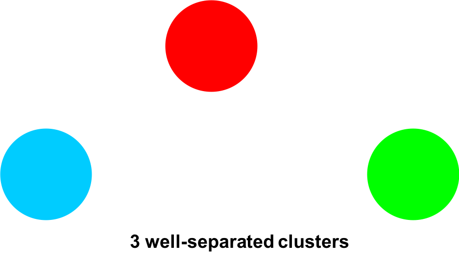
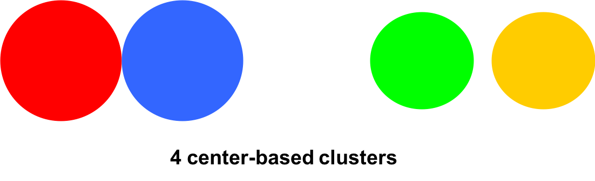
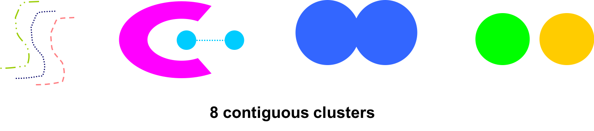
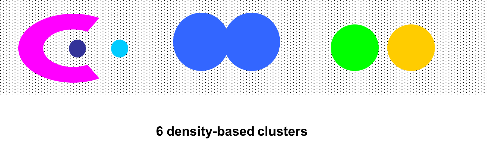
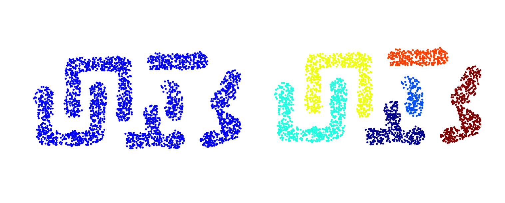
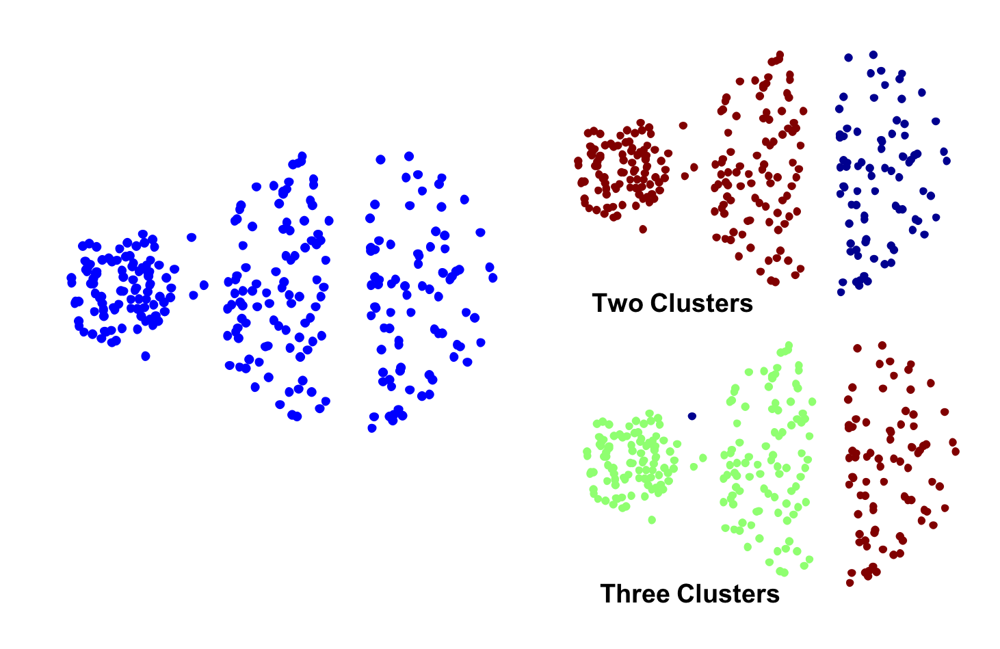
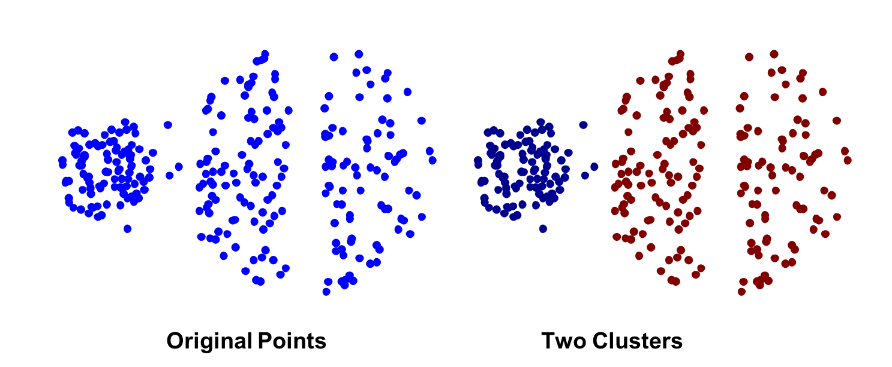
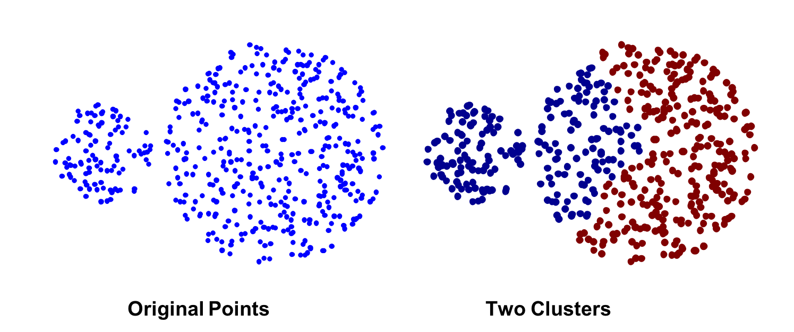
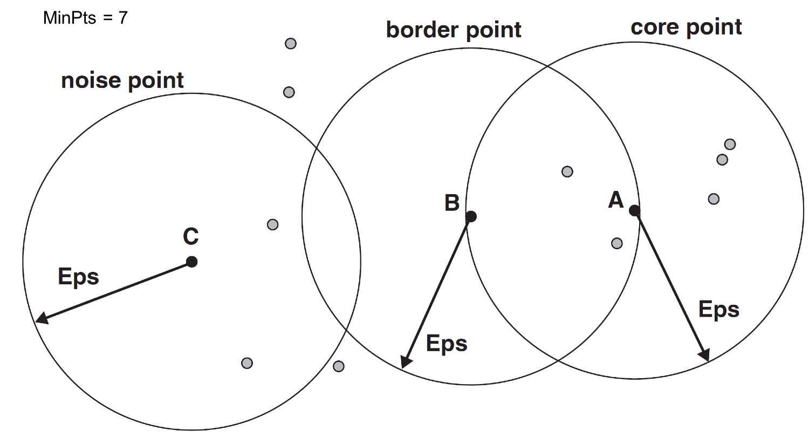
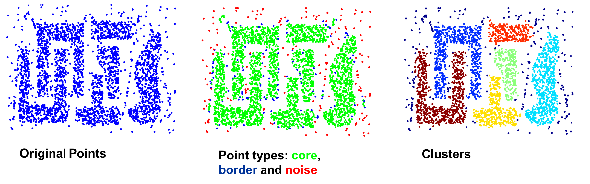

This post a summary of clustering methods I learned from [Data Mining course](https://www-users.cs.umn.edu/~kumar001/dmbook/index.php) at UMN.

Basically, clustering methods can be divided into two types: **hierarchical** and **partitional**.

## Type of Clusters

**Well-Separated Clusters**

A cluster is a set of points such that any point in a cluster is closer (or more similar) to every other point in the cluster than to any point not in the cluster. 

**Center-based clusters**

A cluster is a set of objects such that an object in a cluster is closer (moresimilar) to the “center” of a cluster, than to the center of any other cluster.

The center of a cluster is often a **centroid**, the average of all the points in the cluster, or a **medoid**, the most “representative” point of a cluster.

**Contiguity-based clusters**

A cluster is a set of points such that a point in a cluster is closer (or more similar) to one or more other points in the cluster than to any point not in the cluster.

**Density-based clusters**

A cluster is a dense region of points, which is separated by low-density regions, from other regions of high density. 
Used when the clusters are irregular or intertwined, and when noise and outliers are present. 

## Clusters Algorithms

More about K-meanas and Hierarchical clustering can be found in [another post](https://dymodi.github.io/MLfolds/clustering/Clustering).

### K-means Clustering

Sum of Squared Error (SSE) is usually used to evaluate K-means.

$$SSE=\sum_{i=1}^K\sum_{x\in C_i}\text{dist}^2(m_i,x)$$

K-means has problems when clusters are of differing sizes, densities and non-globular shapes.

K-means has problems when the data contains outliers.

Choosing initial centroids is very important for K-means.

### Hierarchical Clustering

Strengths of Hierarchical Clustering: 

* Do not have to assume any particular number of clusters.
* They may correspond to meaningful taxonomies.

Key operation is the computation of the proximity of two clusters.

We have the following ways to define the inter-cluster distances: MIN, MAX, Group Average, Distance
Between Centroids

**MIN: Single link**, can handle non-elliptical shapes.

However, single link is sensitive to noise and outliers

**MAX: Complete link**, less susceptible to noise and outliers.

The limitations of MAX is:

* Tends to break large clusters
* Biased towards globular clusters

**Group Average**: is a compromis between single and complete Link.

**Ward's Method**: Similarity of two clusters is based on the increase in squared error when two clusters are merged.

### DBSCAN

lDBSCAN is a density-based algorithm.

* Density = number of points within a specified radius (Eps)
* A point is a **core point** if it has at least a specified number of points (MinPts) within Eps 
* A **border point** is not a core point, but is in the neighborhood of a core point
* A **noise point** is any point that is not a core point or a border point 

The DBSCAN algorithm is resisitant to noise, and can handle clusters of different shapes and sizes.

DBSCAN can fail when the data has varying densities and high-dimensional data.

## Cluster Validity

Entropy and SSE can be used to evaluate the performance of clustering.

