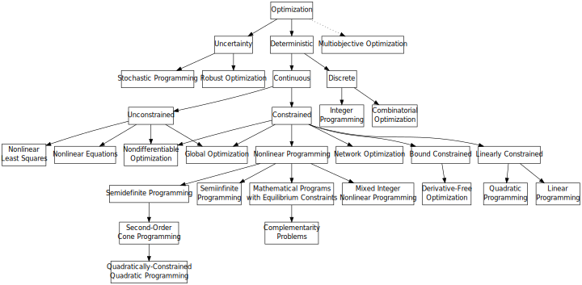

A perspective of the optimization taxonomy is as follows: (figure from [neos-Guide](https://neos-guide.org/content/optimization-taxonomy))

### Rollout Algorithms

An introduction of rollout algorithms can be found [here](http://www.mit.edu/~dimitrib/Rollouts_Survey.pdf). This method is said to be "particularly simple to implement, and is often surprisingly effective."

