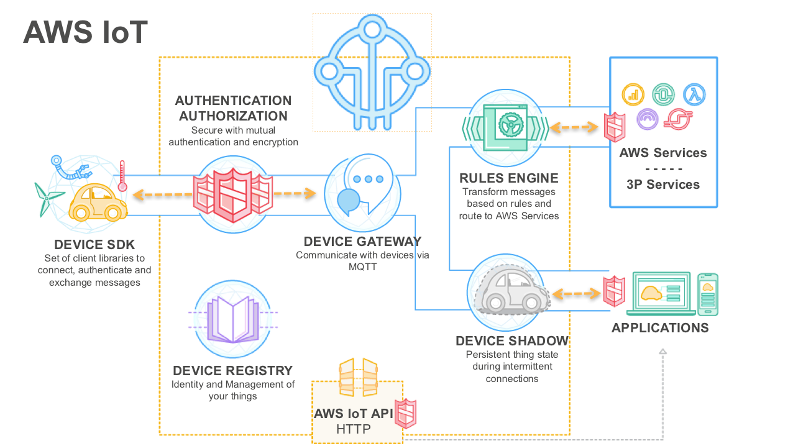
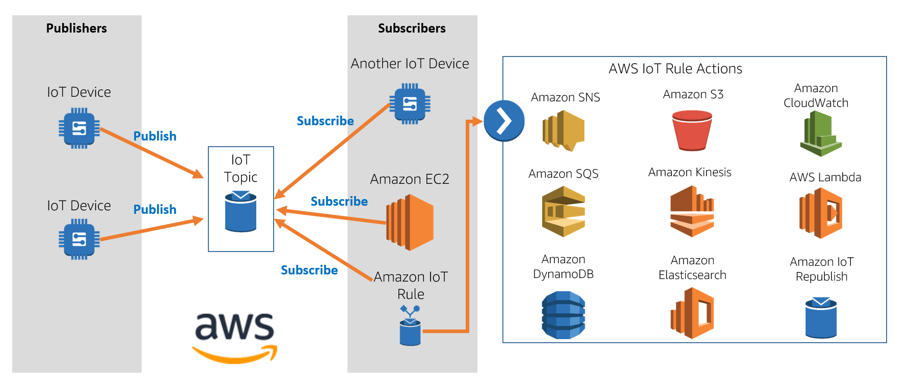
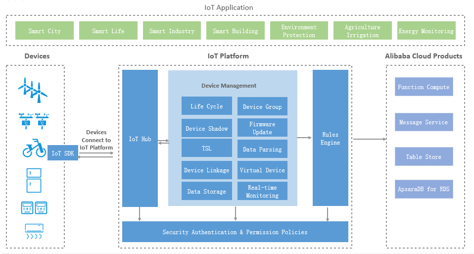

In my understanding, IoT industry is related to the following aspects:

* Application
* Hardware
* Networking
* Data Mining

## IoT Platform

First we show the overview of some leading IoT platforms according to [The 25 best IoT Platforms 2019](https://iot-analytics.com/the-25-best-iot-platforms-2019/).

* Amazon AWS IoT

  * One major claim of AWS IoT is to" Creating a 'Thing' Which Will Represent a Physical Device", which can also be understand as a shadow device.

  * AWS IoT overview

    

    
    

    Figure credits: [Using Alexa Skills Kit and AWS IoT to Voice Control Connected Devices](https://developer.amazon.com/zh/blogs/post/Tx3828JHC7O9GZ9/Using-Alexa-Skills-Kit-and-AWS-IoT-to-Voice-Control-Connected-Devices)

  * Pub-Sub pattern in AWS IoT

    

    
    

    Figure credits: [Introduction to AWS Internet-of-Things (IoT)](https://www.qwiklabs.com/focuses/1804?parent=catalog)

* Microsoft Azure IoT

  * Azure abstract an IoT application into three parts: Things(Device), Insights(Data) and Action(Rule)

  * Azure IoT overview

    

    
    

    Figure credits: [Azure IoT reference architecture](https://docs.microsoft.com/en-us/azure/architecture/reference-architectures/iot/)

* Google Cloud

  * Google divides the system into three basic components, the **device**, **gateway**, and **cloud**.

  * Data management on Google Cloud:

    

    
    

    Figure credits: [Overview of Internet of Things](https://cloud.google.com/solutions/iot-overview)

* Alibaba IoT

  * Aliabab IoT is more like a middleware between device and Alibaba cloud.

    

    
    

    Figure credits: [Architecture](https://www.alibabacloud.com/help/doc-detail/30523.htm)

