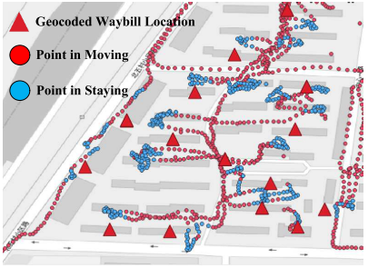

# Related Works of ETA

**Key Words**: Estimated Time of Arrival (ETA)

**Taxonomy**

* Route-based and Route-free
* **Applications**: General Cars, Bus, Express
* **Problem**: Delivery Time, Bus Delay, Travel Time
* **Solutions**:

**Comments**

**Papers**

* ConSTGAT: Contextual Spatial-Temporal Graph Attention Network for Travel Time Estimation at Baidu Maps, *[KDD 2020 Baidu]*
  * **Taxonomy**: General Cars
  * **Input**: Road network, Historical traffic conditions, Background information
  * **Solutions**: a spatial-temporal GNN with a novel graph attention mechanism. (first predict context and traffic)
  * **Contributions**:
    * Tehnical Novelty: (1) Exploite the correlation between spatial and temporal information; (2) Context information (?)
* HetETA: Heterogeneous Information Network Embedding for Estimating Time of Arrival, [KDD 2020 Didi]
  * **Taxonomy**: General Cars, Travel Time
  * **Input**: Road network,  Traffic data
  * **Solutions**: Attention-based GNN
    * Tehnical Tricks: (1) Hierarchical convolution: recent periods, daily periods, weekly periods.
  * Comments:
    * Good taxonomy: Route-based and Route-free
* BusTr: Predicting Bus Travel Times from Real-Time Traffic, *[KDD 2020 Google]*
  * **Taxonomy**: Bus, Bus Delay
  * **Input**: Road traffic
  * **SoA Limitations**: cannot meet the needs of a global-scale transit tracking produc due to cost (for agencies) and privacy (for crowdsourcing methods).
  * Comments: 
    * To adopt different, heterogeneous, sparse data sources, training is conducted on a minimal set of features.
    * For reproducibility, they heavily strip down the training data format and data density.
* Doing in One Go: Delivery Time Inference Based on Couriers’ Trajectories, *[KDD 2020 JD]*
  * **Taxonomy**: Express, Delivery Time, 
  * **Problem Importance**: to "*ease the burdens on the couriers*".
  * **Input**: GPS trajectory
  * **Contributions**:
    * Conceptual: present the first attempt to formalize the delivery time infer- ence problem.
    * Application: the system is deployed in JD Logistics and used internally.
  * **SoA**: extract staying point.
    * SoA Limitations: mismatch between noisy staying points and geocoded locations.
  * Proposed solutions: (1) Data Pre-processing (trajectory parsing); (2) Delivery Location Correction; (3) Delivery Event-based Matching;

## Ref.

[KDD 2020 Baidu] Fang, Xiaomin, Jizhou Huang, Fan Wang, Lingke Zeng, Haijin Liang, and Haifeng Wang. "ConSTGAT: Contextual Spatial-Temporal Graph Attention Network for Travel Time Estimation at Baidu Maps." In *Proceedings of the 26th ACM SIGKDD International Conference on Knowledge Discovery & Data Mining*, pp. 2697-2705. 2020.

[KDD 2020 Didi] Hong, Huiting, Yucheng Lin, Xiaoqing Yang, Zang Li, Kung Fu, Zheng Wang, Xiaohu Qie, and Jieping Ye. "HetETA: Heterogeneous information network embedding for estimating time of arrival." In *Proceedings of the 26th ACM SIGKDD International Conference on Knowledge Discovery & Data Mining*, pp. 2444-2454. 2020.

[KDD 2020 Google] Barnes, Richard, Senaka Buthpitiya, James Cook, Alex Fabrikant, Andrew Tomkins, and Fangzhou Xu. "BusTr: Predicting Bus Travel Times from Real-Time Traffic." In *Proceedings of the 26th ACM SIGKDD International Conference on Knowledge Discovery & Data Mining*, pp. 3243-3251. 2020.

[KDD 2020 JD] Ruan, Sijie, Zi Xiong, Cheng Long, Yiheng Chen, Jie Bao, Tianfu He, Ruiyuan Li, Shengnan Wu, Zhongyuan Jiang, and Yu Zheng. "Doing in One Go: Delivery Time Inference Based on Couriers' Trajectories." In *Proceedings of the 26th ACM SIGKDD International Conference on Knowledge Discovery & Data Mining*, pp. 2813-2821. 2020.

