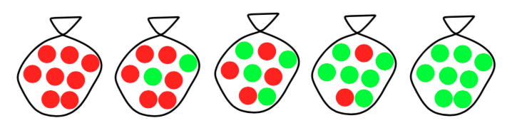

--- 
layout: post
title: Bayesian Learning on the Candy Example
date: Dec. 15, 2017
author: Yi DING
---

[comment]: # (Use the candy example to explain Bayesian learning)

For the Bayesian learning, Professor Arindam Banerjee has a very good example of candy bages. In this post, we use the candy example to explain and summarize Bayesian learning.

## Bayes Theorem
Before we reach out to Bayesian learning. We need first review the idea of [Beyas Theorem](http://www.cs.cmu.edu/afs/cs/project/theo-20/www/mlbook/ch6.pdf).

$$ p(\theta|\mathcal X)= \frac{p(\mathcal X|\theta)p(\theta)}{p(\mathcal X)} $$

$$ p(\theta)= $$ prior probability of hypothesis $$\theta$$

$$ p(\mathcal X)=$$ prior probability of training data $$\mathcal X$$

$$ p(\theta \mid \mathcal X)= $$ posterior probability of $$\theta$$ given data $$\mathcal X$$

$$ p(\mathcal X \mid \theta)= $$ probability of $$\mathcal X$$ given $$\theta$$

## Bayesian Estimation
Usually, we have more than one hypotheses and we want the most probable hypothesis given the training data. That is, Bayesian Estimation can help us choose an appropriate hypothesis from multiple hypotheses (in discrete hypothesis space), or compute the apporprate parameter (in continuous hypothesis space).

**Maximum a posteriori (MAP)**, as its name suggests, is to estimate the parameter $$\theta$$ by maximize the posteriori $$ p(\theta \mid \mathcal X) $$.

$$ \begin{align}
\theta_{\text{MAP}} 
&= \text{argmax}_\theta p(\theta|\mathcal X) \\
&= \text{argmax}_\theta \frac{p(\mathcal X|\theta)p(\theta)}{p(\mathcal X)} \\
&= \text{argmax}_\theta p(\mathcal X|\theta)p(\theta)
\end{align} $$

## Basic Idea
According to Professor Banerjee, "The Bayesian view of learning is updating probability distribution over the hypothesis space." 

Here we use the following notations: $$H$$ is the hypothesis variable, values $$h_1$$, $$h_2$$, .... $$P(h_i)$$ is the prior. We can assume $$P(h_i)=P(h_j)$$ when we have no further information about the prior.

Training data $$\mathcal X=\{x^1,x^2,...,x^N\}$$

Given data, each hypothesis has a posterior:

$$P(h_i|\mathcal X)=\alpha P(\mathcal X|h_i)P(h_i)$$

For prediction, we can use a weighted average over all the hypotheses instead of picking the best-guess one:

$$P(x_\text{test}|\mathcal X)=\sum_i P(x_\text{test}|h_i)P(h_i|\mathcal X)$$

## The Candy Example
Suppose there are five kinds of bags of candies:
* 10% are $$h_1$$: 100% cherry candies
* 20% are $$h_2$$: 75% cherry candies + 25% lime candies 
* 40% are $$h_3$$: 50% cherry candies + 50% lime candies 
* 20% are $$h_4$$: 25% cherry candies + 75% lime candies 
* 10% are $$h_5$$: 100% lime candies

(The figure is taken from Prof. Banerjee's slides)

We take one candy at each time and put the candy back. Then we have the following observations:

We need to answer two questions: 
1. What kind of bag is it?(**Estimation**) 
2. What flavor will the next candy be? (**Prediction**)

Here we compute the the posterior after each candy is drawn:

0. Before any candy is drawn, the posterior is the prior:

|$$p(h_1\|d)$$  |$$p(h_2\|d)$$  |$$p(h_3\|d)$$  |$$p(h_4\|d)$$  |$$p(h_5\|d)$$  |
|---            |---            |---            |---            |---            |
|0.1            |0.2            |0.4            |0.2            |0.1            |
{: .tablelines}

1. After the first candy is drawn, we have:

$$p(h_1|d) = \frac{p(d|h_1)p(h_1)}{p(d)} = \frac{p(d|h_1)p(h_1)}{\sum_{i=1}^{5}p(h_i)*p(d|h_i)}$$

