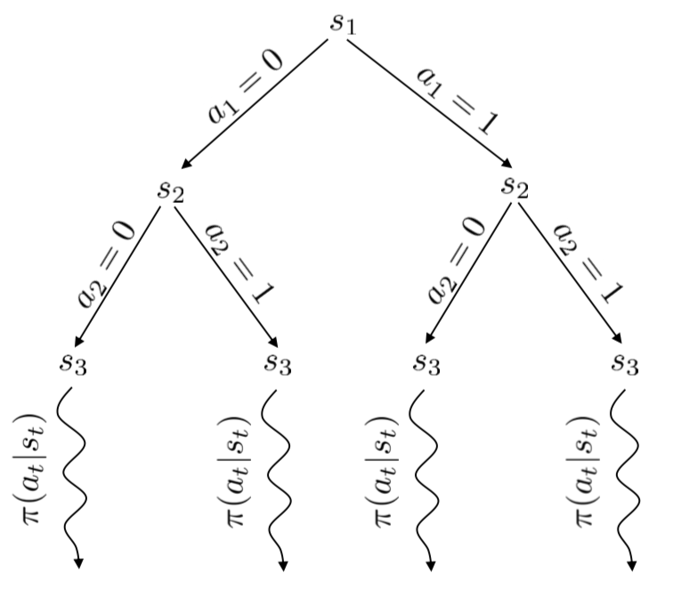

This is a post that summarizes some basic facts on reinforcement learning. The materials comes from [Sergey Levine's Course at Berkeley](http://rll.berkeley.edu/deeprlcourse/)  ([or the archived version](http://rll.berkeley.edu/deeprlcoursesp17/)).

### What problems can be solved by RL
In my opinion, the problems that have **control** kernel will be good to solve with RL methods, such as autonomous driving.

### Basic Concepts

Reinforcement Learning (RL):
* Agent makes **actions**(**decision**) to the environment.
* Agent gets **observations** and **rewards** as the concequences of its **actions**.

Deep Learning:
* Usually refers to multi-layer neural network.
* Provide **end to end** learning (not manually pipeline).

Characteristics of RL:
* No direct supervision.
* Actions have consequences.
* Attempting, try and gather errors.

The reinforcement learning problem **is** the AI problem!

When should we formulate the problem as a RL problem depends on whether we should worry about the sequential decision making. Typical applications are: robotics, autonomous driving, language, business operations and finance.

### Supervised Learning and Imitation
Terminology & Notation:

$$s_t$$ - state

$$o_t$$ - observation

$$a_t$$ - action

$$\pi_\theta(a_t \mid o_t)$$ - policy

$$\pi_\theta(a_t \mid s_t)$$ - policy (fully observed)

#### Imitation Learning
The supervised learning, in facts, is that manual labels provide $$a_t$$ corresponding to a bunch of $$o_t$$. Consider a self-driving car, the road condition is the $$o_t$$, human driver provides $$a_t$$, so that a deep NN can be trained to provide $$\pi_\theta(a_t \mid o_t)$$.

However, some theoratic results have shown that this "supervised learning" does **not** work on the *sequential decision making problem* such as self-driving. Because tiny errors will diverge in the end (compounding error).

While, imitation learning is also valid in practice based on some "stable controller". That is **"Learning from a stabilizing controller"**.

*Case Studies*

* Case study 1: trail following as classification：A Machine Learning Approach to Visual Perception of Forest Trails for Mobile Robots. [1]
* Case study 2: DAgger & domain adaptation: Learning Transferable Policies for Monocular Reactive MAV Control.[2]
* Case study 3: Imitation with LSTMs: Learning real manipulation tasks from virtual demonstrations using LSTM. [3]

#### Problems of Imitation Learning
* Humans need to provide data, which is typically finite.
* Humans are not good at providing some kinds of actions.
* Humans can learn autonomously; can our machines do the same?

**Comments:**
It seems that the RL problem is highly like a **control** problem where we have a "time step" and a "feedback" from outputs of the controlled system. That is, optimal control is a kind of "model-based reinforcement learning". Also note that the state and action here are the same as $$x_t$$ and $$u_t$$ in optimal control.

### Optimal Control, Trajectory Optimization, and Planning (1-25-17)

In this lecture, we will discuss "how to make decisions under perfect knowledge of the system dynamics".

**Trajectory Optimization**

$$\min_{\textbf{u}_1,...,\textbf{u}_T}\sum^{T}_{t=1}c(\textbf{x}_t,\textbf{u}_t) \text{ s.t. } \textbf{x}_t=f(\textbf{x}_{t-1}, \textbf{u}_{t-1})$$

**Shooting Method**

$$\min_{\textbf{u}_1,...,\textbf{u}_T} c(\textbf{x}_1,\textbf{u}_1)+c(f(\textbf{x}_1,\textbf{u}_1),\textbf{u}_2)+...+c(f(f(...)...),\textbf{u}_T)$$

**Collocation Method**

$$\min_{\textbf{u}_1,...,\textbf{u}_T,\textbf{x}_1,...,\textbf{x}_T}\sum^{T}_{t=1}c(\textbf{x}_t,\textbf{u}_t) \text{ s.t. } \textbf{x}_t=f(\textbf{x}_{t-1}, \textbf{u}_{t-1})$$

Note the difference of optimization variables in the above two methods. In collocation method, both $$\mathbf{u}$$ nd and $$\mathbf{x}$$ are optimized at the same time.

**Linear case: LQR**

LQR: Linear dynamic, quadratic cost.

An old blog of mine on LQR can be found [here](https://blog.csdn.net/dymodi/article/details/46303633) (in Chinese).

$$\min_{\textbf{u}_1,...,\textbf{u}_T} c(\textbf{x}_1,\textbf{u}_1)+c(f(\textbf{x}_1,\textbf{u}_1),\textbf{u}_2)+...+c(f(f(...)...),\textbf{u}_T)$$

$$f(\textbf{x}_t,\textbf{u}_t)=\textbf{F}_t\begin{bmatrix} \textbf{x}_t \\ \textbf{u}_t \end{bmatrix}+\textbf{f}_t$$

$$c(\textbf{x}_t,\textbf{u}_t)=\frac12 \begin{bmatrix} \textbf{x}_t \\ \textbf{u}_t \end{bmatrix}^T\textbf{C}_t\begin{bmatrix} \textbf{x}_t \\ \textbf{u}_t \end{bmatrix}+\begin{bmatrix} \textbf{x}_t \\ \textbf{u}_t \end{bmatrix}^T\textbf c_t$$

Base case: we solve for $$\textbf{u}_t$$ only. Let the previous term to be a constant and let the derivation to be zero, we have:

$$\textbf{u}_t=\textbf{K}_t\textbf{x}_t+\textbf{k}_t$$

For nonlinear case, it can be trasformed to LQR with Taylor expansion.

Iterative LQR is something comparable to Newton's method.

**Discrete case: Monte Carlo tree seach (MCTS)**

Build a decision tree and run some random search to have a glimpse of the quality of the decision sequences. It's a heuristic search algorithm.

Fig 1. MCTS sketch from Levine

It seems that in MCTS, we randomly check some future state according to the action we can make (at the root node), and then choose the best action based on the sampled observation.

Note that, MCTS is used in Alpha Go.

### Learning Dynamical System Models from Data (1-30-17)

In this part, we discuss what to do if we do **not** know the dynamics of the system.

Why we need model: we need to do derivation in for the cost function and we also need to perform forward prediciton in MCTS.

**Four versions of model-based RL**

A model-based RL version 0.5 is introduced where model is built using an **system identification** paradigm. This works well if the real model can be built with our knowledge of physics and only some parameters need to be fitted.

In RL version 1.5, MPC (model predictive control) is introduced to improve RL, i.e. only one step active is applied.

*Case studies:* A 2.0 version RL to control a robotic arm. 

**What kind of modes can we use?**

Gaussian process / Neural network / GMM (Gaussian Mixture Model)

*Case studies*: Dynamics with recurrent neural networks. Compared with many other fancy models.

**Global model** and **local model**

*Case studies*: Local models & iterative LQR

### Learning Policies by Imitating Optimal Control (2-1-17)

$$\pi_\theta : \mathbf x \to \mathbf u$$

The training data is $$\mathbf x$$ and $$\mathbf u$$ and we want to learn a policy $$\pi_\theta$$ by optmizing a cost function.

Dual gradient descent is used to solve contrained optimization problem to conduct policy search.

*Case studies*: vision-based control with GPS (guided policy search).

 PLATO algorithm is an algorithm that imitates MPC to get policy.

The key part of MPC is replanning.

There is also a comparison of DAgger and GPS.

### Direct Collocation on Methods for Trajectory Optimization and Policy Learning (2-6-17)

Three topics are discussed by Igor Mordatch.

1. Trajectory Optimization with Direct Collocation

   In ***direct collocation***, unlike collocation and shooting methods, we only optimize states $$\mathbf{x}$$, while control $$\mathbf{u}$$ is get from an inverse dynamic function. **Inverse Dynamic Model** is used in the optimzation.

2. Learning Control Policies with Direct Collocation

   The so-called learning control policies is to learn a $$\pi_\theta$$ from data by optimizing $$\theta$$ over the the same cost function with shooting method and collocation method. It seems that Markov Decision Process (MDP) is a way to learn the policy.

3. Unknown/Uncertain Dynamics and Applications

### Ref.

[1] Giusti, A., Guzzi, J., Cireşan, D. C., He, F. L., Rodríguez, J. P., Fontana, F., ... & Scaramuzza, D. (2016). A machine learning approach to visual perception of forest trails for mobile robots. IEEE Robotics and Automation Letters, 1(2), 661-667. [IEEE](http://ieeexplore.ieee.org.ezp1.lib.umn.edu/stamp/stamp.jsp?tp=&arnumber=7358076)

[2] Daftry, S., Bagnell, J. A., & Hebert, M. (2016, October). Learning transferable policies for monocular reactive MAV control. In International Symposium on Experimental Robotics (pp. 3-11). Springer, Cham. [Arxiv](https://arxiv.org/pdf/1608.00627.pdf)

[3] Rahmatizadeh, R., Abolghasemi, P., Behal, A., & Bölöni, L. (2016). Learning real manipulation tasks from virtual demonstrations using LSTM. arXiv preprint arXiv:1603.03833. [Arxiv](https://arxiv.org/pdf/1603.03833.pdf)
