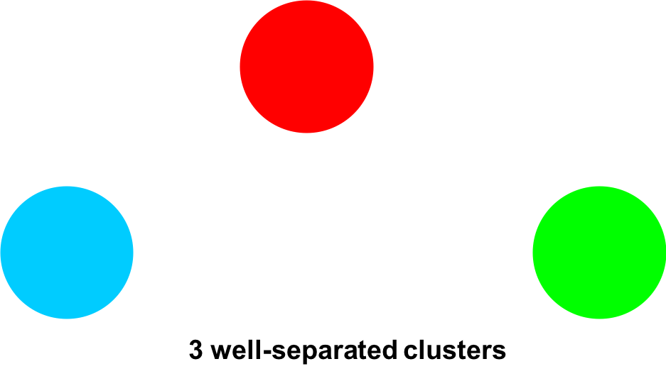

This post a summary of clustering methods I learned from [Data Mining course](https://www-users.cs.umn.edu/~kumar001/dmbook/index.php) at UMN.

Basically, clustering methods can be divided into two types: **hierarchical** and **partitional**.

## Type of Clusters

**Well-Separated Clusters**

A cluster is a set of points such that any point in a cluster is closer (or more similar) to every other point in the cluster than to any point not in the cluster. 

**Center-based clusters**

A cluster is a set of objects such that an object in a cluster is closer (moresimilar) to the “center” of a cluster, than to the center of any other cluster.

The center of a cluster is often a **centroid**, the average of all the points in the cluster, or a **medoid**, the most “representative” point of a cluster.

**Density-based clusters**

**Confusinon Matrix**

