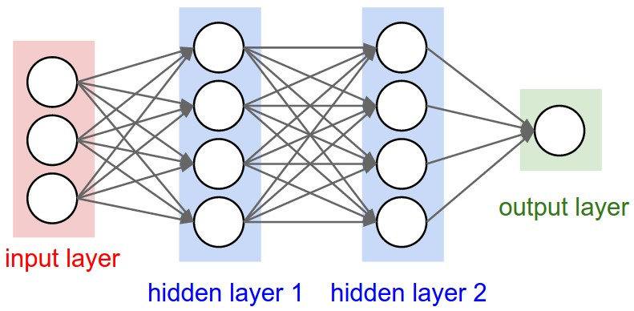
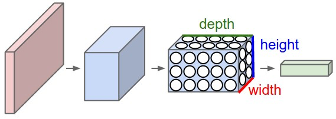

In this tutorial, we will basically follow the [official tutorial](https://www.tensorflow.org/get_started/mnist/pros) but will change some parts to make it easier to understand. 

## Convolution Neural Network
Note that, according to [Convolutional Neural Networks for Visual Recognition, Stanford, CS231n](http://cs231n.github.io/convolutional-networks/) "ConvNet architectures make the explicit assumption that the inputs are images".

One reason that we need ConvNN for images is that regular NNs do not scale well to full images.

ConvNN is made up of layers, each layer transform a 3D volumn to another 3D volumn with differentiable functions. Three types of layers are used: **Convolutional Layer**, **Pooling Layer**, and **Fully-Connected Layer** (exactly as seen in regular Neural Networks)

    
    Traditional NN

    
    CNN

(Figures come from [Convolutional Neural Networks for Visual Recognition, Stanford, CS231n](http://cs231n.github.io/convolutional-networks/))

In this way, ConvNets transform the original image layer by layer from the original pixel values to the final class scores.

### Convolutional Layer
Convolutional layer is the key section of ConvNN. In convolutional layer, some filters (specific edges, colors...) are used to slides along width and height for all depth. For example, we use 12 filters with size 5\*5\*3 to on a 32\*32\*3 image, the output volumn will be 32\*32\*12 (we stack 12 2D volumns).  

Each pixel is **locally** connected to the corresponding pixel in the input volumn.

Three hyperparameters control the size of the output volume: the **depth**, **stride** and **zero-padding**.

The depth corresponds to how many filters we would like to use in the convolution.

The stride is the step length we would like to move when we slides along width or height. 1 or 2 is commonly used as stride while 3 or more is rare in practice.

Zero-padding is a hyperparameter handling with border elements. Generally, zero padding of 1 is used to keep the output size same as input size.

### Pooling Layer
It is common to periodically insert a Pooling layer in-between successive Conv layers in a ConvNet architecture. Pooling can reduce the parameters in the ConvNN dramatically and hence avoid overfitting.

Generally, a 2*2 filter is used with stride 2 to do downsammpling. For a 2D volumn, only 25% content will be kept after pooling.

### Fully-connected layer
Neurons in a fully connected layer have full connections to all activations in the previous layer, as seen in regular Neural Networks. 
