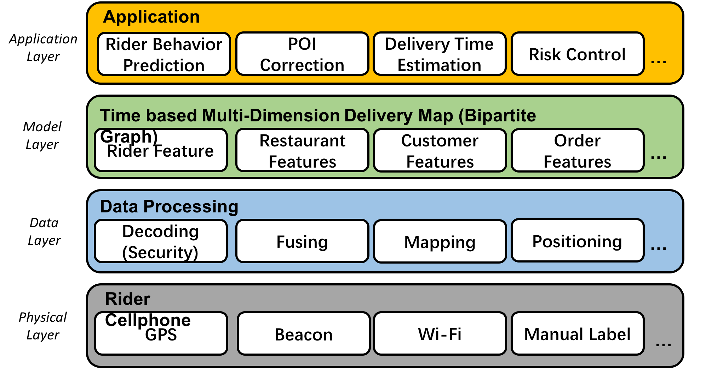
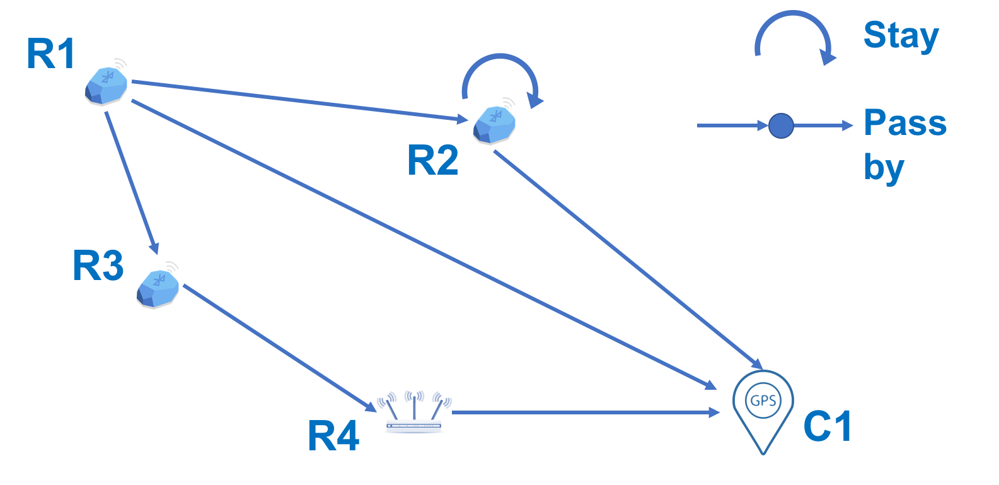

--- 
layout: post
title: 2018 MobiSys Paper Outline
date: Oct. 12, 2017
author: Yi DING
---

[comment]: # (This is the outline 2 for the 2018 MobiSys paper)

NOTE: This the second version of the draft.
 
## 1 INTRODUCTION

[comment]: # (The importance of the problems addressed)
[comment]: # (The novelty of the proposed solutions)
[comment]: # (The technical depth)
[comment]: # (The potential impact)

**(The background of food delivery system)**

In recent years, with the prevalence of the mobile Internet and sharing economy, online food ordering and delivery becomes a prosperous market. Driven by the mobile Internet technololy, a new business model is emerging with a centralized platform serving customers, restaurants and riders at the same time [][][]. Restaurants can operate online shops on the platform and accept orders while customers can choose from plenty of restaurants nearby from the cellphone APP provided by the platform. The food delivery tasks will be dispatched to registered and crowdsourced riders according to their location and destination. As the platform provides convenient service for all three sections, some problems also restrain the platform from achieving high efficiency dispatching. The most critical problem is to estimate the rider's travelling time among restaurants and customers. The estimation must be tight because food must be delivered within limited time (usually within 30 minutes) for fresh quality and the time-out case would be punished with costs.

**(Challenges and motivations)**

A practical food delivery is a complex system with many constraints and objectives. The food needs to be delivered usually within 30 minutes to guarantee the quality of the food. Time-out will also be punished with penalites for both platform and riders. The delivery time is the key point in the system: the platform needs to estimate the time for dispatching, the rider wants to take as many orders as possible within the time constraints, and the customers want their meal to be delivered as soon as possible. However, simple estimation methods  is not apfor food delivery system due to many pracitical isses: (1) The physical distance of two POI does reflects the time needed from one place to the other due to differnt floors and building layouts; (2) The time needed to prepare the meal varies from restaurant; (3) The time needed for the rider to travel between POIs varies with the rider's age and familiarity with the POIs (4) External factors such as weather and rush hour also affects the delivery time to some extent.

**(Upper layer application based on time map)**

Besides delivery time estimation and delivery tasks dispatching, many other application can be developed based on the time-based map to resolve the practical problems met in food delivery system. For example, (1) the fraud behavior of riders and restaurants can be detected in a anomally detection manner; (2) Dynamic pricing can be conducted according to the rider's behavior; (3) Wrong POI information (can be a severe problem for many other application) can be detected and corrected.  

**(Our solution)**

In this paper, we build a food delivery system consists of four layers: (1) Physical layer for collecting reald world data; (2) Data layer for storing and preprocessing data; (3) Model layer to build and analyse a time-based map to estimate rider's travelling time between restaurants, this is the main contribution of the paper; (4) Application layer for real world needs. We take POI correction and delivery time estimation as example in this paper. 

**(The contribution of this paper)**

To the best of our knowledge, this is the first paper that uses a (dynamic) time-based map to estimate the travelling time of the riders in a delivery system. The effectiveness of the system is verified a large scale real world system. The scale of the system is larger than any other system studied before in the followings aspects: For the physical layer, we have more than 15,000 beacons in 15,000 shops in Shanghai. For the sensor layer, more than 20,000 riders act as "sensors" with cellphone with them. Particularly, in the former studies the many, more than 600 types have cellphone have been involved in the system, which shows the effectiveness of our system in real world scenario. 

## 2 Motivation
**(Challenges and motivations)**

A practical food delivery is a complex system with many constraints and objectives....

## 3 System Overview
The system overview can be seen in the Figure 1.

## 4 Application Layer
We can build the following applications based on our system: (1) Rider's Behavior Prediction; (2) Delivery Time Estimation; (3) POI Correction; (4) Risk Control; (5) Dynamic Pricing; (6) Hub-based Delivery.

Rider's bebavior is predicted using **Bayesian estimation**.

### 4.1 Rider Behavior Prediction
The rider behavior prediction will be conduct based on Bayesian estimation.

## 5 Model Layer (Time-based Multi-Dimension Delivery Map)
This is the main contribution of this paper. In the model layer, we build a time-based multi-dimenion delivery map to handle the complex problems met in delivery problem. The map will be built in the machine learning 
paradigm and update dynamically. A concept map can be found in Figure 2.

There are two types of vertices in the map: restaurant and customer. Each vertex is a high dimensional representation of the object. The features are categorized into following types: rider features, restaurant features, customer features, order features and other features.

The map is a **bipartite graph** since restaurant and customers are different types of vertices.

The estimation of the travelling time can be trained in an **logistic regression** manner.

## 6 Data Layer (Data Processing)
In the data processing layer, data from different platforms are clustered, decoded and fused for the upper layer.

## 7 Physical Layer (Data Collection)
Physical layer is the bottom layer of the system and is responsible for collecting data from physical world.

## 8 Conclusion

