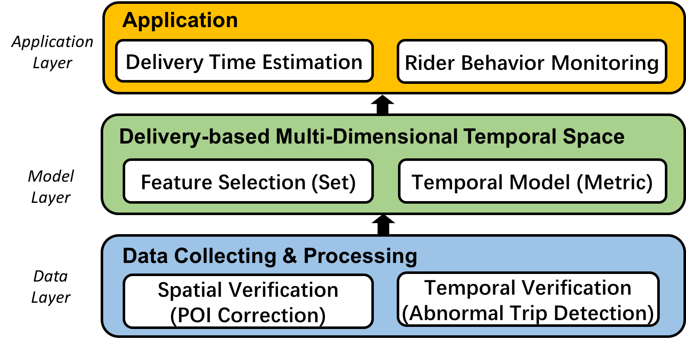
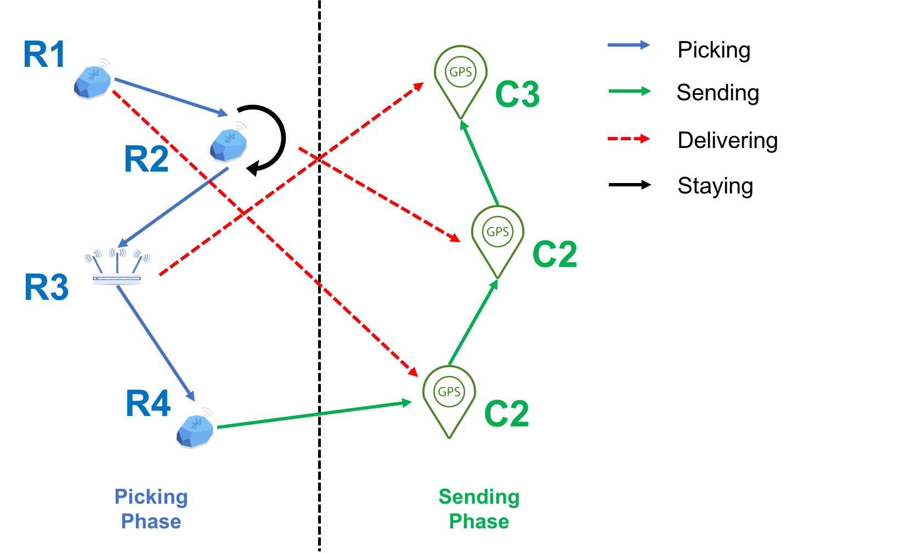
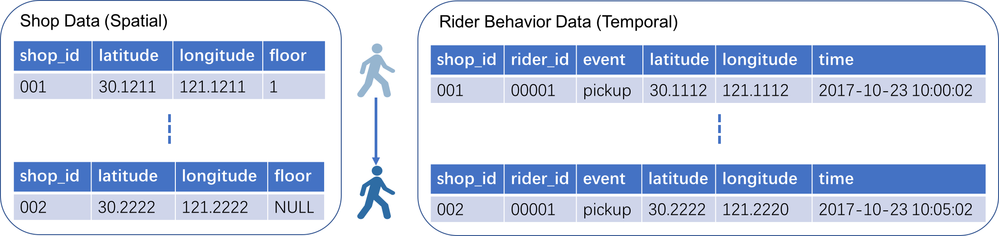

--- 
layout: post
title: 2018 MobiSys Paper Outline
date: Oct. 25, 2017
author: Yi DING
---

[comment]: # (This is the outline 3 for the 2018 MobiSys paper)

NOTE: This the third version of the draft.
 
## 1 INTRODUCTION

[comment]: # (The importance of the problems addressed)
[comment]: # (The novelty of the proposed solutions)
[comment]: # (The technical depth)
[comment]: # (The potential impact)

**(The background of food delivery system)**

In recent years, with the prevalence of the mobile Internet and sharing economy, online food ordering and delivery becomes a prosperous market. Driven by the mobile Internet technololy, a new business model is emerging with a centralized platform serving customers, restaurants and riders at the same time [][][]. Restaurants can operate online shops on the platform and accept orders while customers can choose from plenty of restaurants nearby from the cellphone APP provided by the platform. The food delivery tasks will be dispatched to registered and crowdsourced riders according to their location and destination. As the platform provides convenient service for all three sections, some problems also restrain the platform from achieving high efficiency dispatching. The most critical problem is to estimate the rider's travelling time among restaurants and customers. The estimation must be tight because food must be delivered within limited time (usually within 30 minutes) for fresh quality and the time-out case would be punished with costs.

**(Challenges and motivations)**

A practical food delivery is a complex system with many constraints and objectives. The food needs to be delivered usually within 30 minutes to guarantee the quality of the food. Time-out will also be punished with penalites for both platform and riders. The delivery time is the key point in the system: the platform needs to estimate the time for dispatching, the rider wants to take as many orders as possible within the time constraints, and the customers want their meal to be delivered as soon as possible. However, simple estimation methods are not applicable for food delivery system due to many pracitical isses: (1) The physical distance of two POI does reflects the time needed from one place to the other due to differnt floors and building layouts; (2) The time needed to prepare the meal varies from restaurant; (3) The time needed for the rider to travel between POIs varies with the rider's age and familiarity with the POIs (4) External factors such as weather and rush hour also affects the delivery time to some extent.

**(Upper layer application based on time map)**

Besides delivery time estimation and delivery tasks dispatching, many other application can be developed based on the time-based map to resolve the practical problems met in food delivery system. For example, (1) the fraud behavior of riders and restaurants can be detected in a anomally detection manner; (2) Dynamic pricing can be conducted according to the rider's behavior; (3) Wrong POI information (can be a severe problem for many other application) can be detected and corrected.  

**(Our solution)**

In this paper, we build a food delivery system consists of four layers: (1) Physical layer for collecting reald world data; (2) Data layer for storing and preprocessing data; (3) Model layer to build and analyse a time-based map to estimate rider's travelling time between restaurants, this is the main contribution of the paper; (4) Application layer for real world needs. We take POI correction and delivery time estimation as example in this paper. 

**(The contribution of this paper)**

To the best of our knowledge, this is the first paper that uses a (dynamic) time-based map to estimate the travelling time of the riders in a delivery system. The effectiveness of the system is verified a large scale real world system. The scale of the system is larger than any other system studied before in the followings aspects: For the physical layer, we have more than 15,000 beacons in 15,000 shops in Shanghai. For the sensor layer, more than 20,000 riders act as "sensors" with cellphone with them. Particularly, in the former studies the many, more than 600 types have cellphone have been involved in the system, which shows the effectiveness of our system in real world scenario. 

## 2 Motivation
**(Challenges and motivations)**

A practical food delivery is a complex system with many constraints and objectives....

## 3 System Overview
The system overview can be seen in the Figure 1.

Acutally, we should call it a space instead of a map. It is similar as a metric space in the sense that a distance function is defined. However the symmetry condition is obviously not met and we cannot prove triangle law. 

The time-based map is a conceptual kernel and can be implemented with many ways: MDS, machine learning model such as rbf-svm or Deep NN. As long as the model's input is the event(vertex) and can output a metric is supported 

### 3.1 Application
Based on the time map, we can measure and estimate the time difference or time similarity between two places (events). Some applications can be:
* Estimate delivery time by summing rider's estimated trip.
* Dispatching based on rider's arrival time at next restaurant.
* Rider behavior monitoring based on metric of his trace on the map and his reported trip.

## 4 Multi-Dimensional Temporal Delivery Space
Since new machine learning methods are coming out every day. We are not restrain ourselves in a fixed machine learning methods. Instead, we are offering some basic operation and interface, different ml algorithms that can fullfill the basic requirements can all be used in this space to estimate the delivery time.

Similar as metric space, temporal delivery space is an ordered pair $(M,t)$ where $M$ is a set and $t$ is a metric on $M$, i.e., a function. 

$$t: M \times M \to \mathbb{R}$$

Specifically, $t$ measures the time needed to travel from a point to another point in the delivery space. Note that the point in the delivery is not necessary a place, since we have more dimensions besides latitude and longtitude. Floor, weather, rush hour/non-rush hour can also be dimensions to describe a point in the delivery space. The dimension selection will be introduce int the **4.1** section, which is more or less similar like feature engineering in machine learning. the function $t$ will be discussed in the **4.2** section. 

Also note that temporal delivery space is not a metric space since symmetry ($d(x,y) = d(y,x)$) does not holds. Consider a simple case measure the time need between to two shops where one shop is in the first floor and the other in the 5th floor. If there is no elevator and the rider has to use the stairs, it can be expected that the time needed to go from 5th floor is less than that needed to go from first floor to 5th floor.

The $basic assumption$ is that the time needed to travel between to places is determined and only determined by the related factors such as lat/lon, floor, weather.

### 4.1 Dimension selection (Feature selection)

Dimensions(Features)

|Name           |Symbol     |Type           |Code value |Description                            |Category   |
|---            |---        |---            |---        |---                                    |---        |
|Position Type  |$\tau$     |$\mathbb{N}$   |0,1        |0:restaurant; 1:customer               |Address    |
|Latitude       |$lat$      |$\mathbb{R}$   |--         |The latitude of the place              |Address    |
|Longitude      |$lon$      |$\mathbb{R}$   |--         |The longitude of the place             |Address    |
|Floor          |$flr$      |$\mathbb{N}$   |--         |The floor of the place                 |Address    |
|Month of Year  |$mon$      |$\mathbb{N}$   |1,2,...,12 |The month in the year                  |Time Slot  |
|Day of Week    |$day$      |$\mathbb{N}$   |1,2,...,7  |The day in the week                    |Time Slot  |
|Weather        |$wth$      |$\mathbb{N}$   |0,1,...,5  |The weather. 0: sunny; 1: cloudy; etc. |Environment|

**Position**: an element $p \in M$, or a point in the temporal delivery space.

**Event**: an ordered pair $(s, d)$ where $s \in M, d \in M$. Here $s$ is the source position, $d$ is the destination position.

For any event, we can compute the time it needed.

For delivery system, the data is organized order by order, for each order, the following information is maitained:

|Field          |Description                        |
|---            |---                                |
|Order ID       |Unique ID for tracking the order   |
|Rider          |The rider who deliver the order    |
|Restaurant     |The restaurant that make the meal  |
|Customer       |The customer who make the order    |
|Order Time     |The date and time the order is make|

Although theoretically we can compute the time needed for any event, some event has no physical meanings such as  the time needed from a resutaurant on "a winter, Tuesday, sunny day" to a restauant on a "summer, Friday, rainy day". We summarize some typical events as following:

*Staying*: $postition_{s} = position_{d}$

*Picking*: $\tau_{d} = 0$, $mon_{s}=mon_{d}$, $day_{s}=day_{d}$

*Sending*: $\tau_{d} = 1$, $mon_{s}=mon_{d}$, $day_{s}=day_{d}$

Specifically, for an order from Restaurant $r$ to Customer $c$ at time $T$, we care about the following delivery event:

*Delivering*: $\tau_{s} = 0$, $\tau_{d} = 1$, $address_{s} = r$, $address_{d} = c$,  $time slot_{s} = time slot_{d} = T$

The typical events are illustrated in the following figure:

### 4.2 Time estimation
After the features are determined, the time estimation can be implemented in many ways. 
Such as, RBF SVM.

## 5 Data Inconsistency Detection and Correction for Delivery
In practical situations, data gathered from restaurants and riders might be inaccurate due to many reasons. A typical data collection scheme is illustrated in the following figure. 

In processinhg the real world data, we find following problems in the datasets:

1. Missing value (Floor number missing for many restaurants)
2. Inaccurate POI information (Wrong latitude/longitude)
3. Inaccurate labels (Wrong labels from riders)

Before utilizing the data for modeling, we need to verify the data consistency and remove or correct the wrong data. Thanks to the various data sources, same event is usually covered by multiple data reocords hence that redundency existis. Verification is possible due to data redundency. For example, The rider's arrival at a restaurant is recorded in the riders' behavior data and rider's trace data.

Data inconsistency has been studied in many papers and some classical methods were proposed to detect and repair error data. CFD is the most important method in this field, other methods also includes Bayesian estimation and maximum likelihood. However, these methods cannot be use in the delivery system. CFD cannot be used because explicit semantic dependency is lacking in the system. Moreover, data inconsistency in delivery system tends to be quantitative instead of logical, hence manually defined funtional dependency cannot capture all the error data. Moreover, existing methods usually based on a single relation table, while in our case, data are gather from different sources. Data inconsistency might happen during the data fusing process.

In our method, we find the data inconsistency by first clustering the data to rider-related and restaurant-related. Then we compare the data with rider's mobility pattern and restaurant's operation pattern.

The basic idea is to compare the rider's trace and event data with the typical rider mobility pattern. We first conduct restaurant-oriented data clustering and rider-oriented data clustering. Abnormal data is detected if the sample is rejected by the distribution.

* Rider Mobility Pattern
* Restaurant Event Pattern

The data inconsistency in the data can be detected by finding out the abnormal events. The abnormal event $\xi$ is defined as follows:

$$\left| \tilde t(\xi) - \hat t(\xi) \right| > \epsilon(\xi)$$

where $\tilde t(e)$ is the observed time for event $e$. $\hat t(e)$ is the estimated time for event $e$ based on empirical distance function $t$. 

### 5.1 Spatial Inconsistency (POI Correction) (Clustering by shop)
Spatial Inconsistency is detected via compare the each single rider's trace data with rider mobility pattern built from massive rider trace data.

**Rider Mobility Pattern**

Rider's mobility pattern can be viewed as speical subset of generic human mobiliy pattern [][]. For the rider's mobility pattern, we focus on the following two distributions:
* Rider indoor speed distribution
* Rider outdoor speed distribution
* Rider trip length distribution

Indoor speed distribution can be built based on rider's indoor trace gathered from beacon data.

Outdoor speed distibution can be built based on rider's outdoor trace gathered from GPS data.

The following data error type is found:
* Restaurant POI inaccuracy
* Customer POI inaccuracy

**Data Correction**
Data correction can be achieved by minizing the residual error between the distances related the error data in the temporal space. That is, suppose the a restaurant has a error POI (lat and lon), the observe the distance related 

$$ \underset{lat,lon}{\text{minimize}} \sum \lvert d_{observed}-d_{expected} \rvert $$

### 5.2 Temporal Inconsistency (Rider Fraud) (Clustering by rider)
**Rider Behavior Pattern**
* Riders' Accepting time distribution

**Restaurant Behavior Pattern**
* Waiting time distribution
* Restaurant Delivery time distribution

## 6 Application for Delivery

## 7 Evaluation
We can consider following indicators to evaluate the effectiveness of our methods and others' methods.

1. Delivery Time estimation.
Related data can be found in the table "dw_ai.dw_aly_t_model_4_3_feature_v5"

## 8 Related Work

**Navigation with time map** is a topic that ... 
[Time Map]

**Time estimation for delivery task** has been studied in many literature.
[FooDNet], [Some other papers from Crowd Delivery Related Work]

**POI correction** is a similar topic as location estimation in the sensor network.
[Some papers in POI Correction]

## 9 Conclusion

