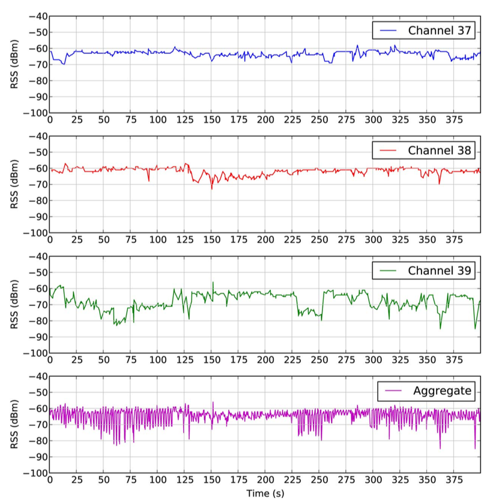

--- 
layout: post
title: Baisc Facts
date: Sep. 20, 2017
author: Yi DING
---
[comment]: # (Some basic facts about beaocn)

In this post we gather some basic facts on beacon both from Academia and Industry

## Proximity Definition
According to [1], the beacon proximity is defined as follows:

|Zone       |Distance           |
|-------    |------             |
|Immediate  |<1m                |
|Near       |1-3m               |
|Far        |>3m                |
|Unknow     |Device not ranged  |

## RSSI - Distance Conversion
Many literature talks about the "path-loss" model when doing the conversion.

According to [1][2], the relaiton is:
$$ RSSI = -10*n\log_{10}d + A $$
where $A$ is the received RSSI in dB at one meter, $n$ is the path loss exponent that need to be fitted in different environment. The typical value of $n$ is 0.9116 and 1.246 in [1] and 1.3 in [2].

## RSS variation with time (static devices)
According to [3], RSSI fluctuation is not negligible even for the static devices. The RSS variation with time (static device) is: (Figure from [3])

 

## RSS variation with distance (receiver moving)
When moving towards/away from beacons, the RSS received at the receiver suffers from fast fading. Which can be a major concern for either fingerprinting or trilateration. The RSS variation with distance (receiver moving) can be shown as: (Figure from [3])

 

## Ref.
[1] Zafari, F., Papapanagiotou, I., Devetsikiotis, M., & Hacker, T. (2017). An iBeacon based Proximity and Indoor Localization System. arXiv preprint arXiv:1703.07876.

[2] Subedi, S., Kwon, G. R., Shin, S., Hwang, S. S., & Pyun, J. Y. (2016, July). Beacon based indoor positioning system using weighted centroid localization approach. In Ubiquitous and Future Networks (ICUFN), 2016 Eighth Internat

[3] Faragher, R., & Harle, R. (2015). Location fingerprinting with bluetooth low energy beacons. IEEE journal on Selected Areas in Communications, 33(11), 2418-2428.