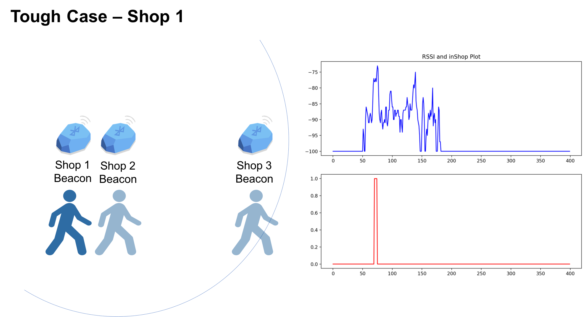
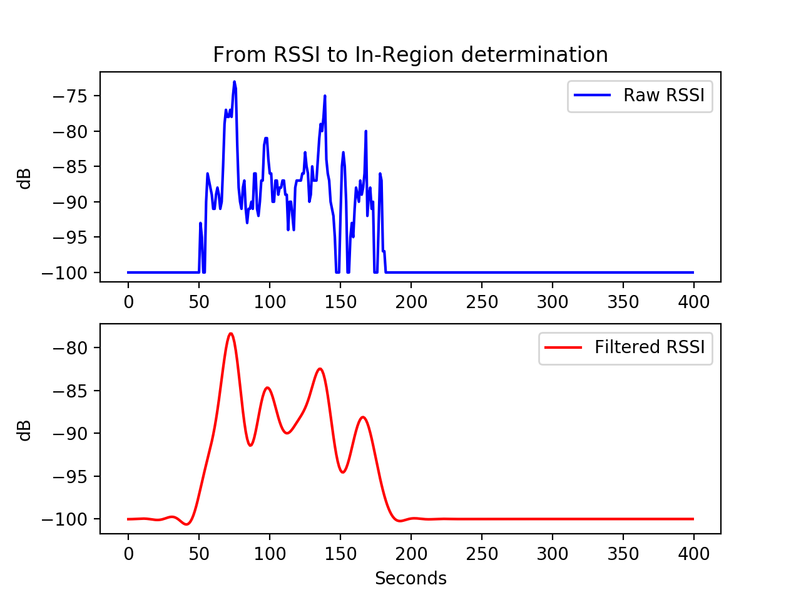
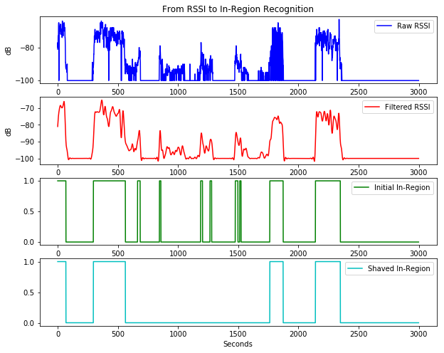

--- 
layout: post
title: Entrance and Departure Detection Base on BLE Beacon RSSI - Filtering and Shaving
date: June 13, 2017
author: Yi DING
---

[comment]: # (This blog compose the SIGNAL PROCESSING or LOCALIZATION section of future paper)

The code related to this blog can be found [here](https://github.com/dymodi/Beacon/blob/master/Beacon-RSSI-Filtering.py).

## Backgrounds
When iBeacon is put forward by Apple in 2014 for the first time, it was designed to detect the time that a device enters and leaves a region. According to the [documentation](https://developer.apple.com/ibeacon/Getting-Started-with-iBeacon.pdf),  RSSI (Received Signal Strength Indication) is used in the monitoring and ranging. However, no more details are provided for the detection mechanism. Since RSSI is influenced by many factors and suffers from strong fluctuation, simply reporting entrance and departure when receiving/not receiving RSSI value is not reliable. 

In this blog, we basically discuss how to detect the entrance and departure of a device for a specific region indicated by a BLE beacon accurately. Note that the methods provided here is platform independent since the methods are based on raw RSSI data from the system level. Hence both iOS and Android system can utilize the methods. Also note that the methods here are aimed for offline analysis but not real-time detection. However, I believe that the basic ideas can be applied for real-time detection with minor modification.

Actually, BLE Beacon has been used in indoor localization in recent years (A review can be found [here](https://dymodi.github.io/Research/Beacon-Localization-Related-Works)). Although localization sounds to be a more advanced technology, entrance detection is also of great importance in real world applications. The store want to know how much time the customer stayed around different types of goods. The food delivery company want to know when the rider arrives and leaves the restaurant. Moreover, localizations often calls for a very condensed beacon hardware deployment, while entrance detection can be accomplished with a single beacon hardware. Topics on beacon based localization will be discussed in the future blogs.

## Real World Examples
Now we consider some real world examples where three beacons are placed at three shops, let's say, Shop 1, Shop 2 and Shop 3, where Shop 1 and Shop 2 are quite close. A man with a device is walking from left to right and stay at each shop for a while, we need to decide when the man has come into each region. Also note that some appropriate APPs must be installed beforehand to recognize the beacons.

As we can see in the above figure, to tell the entrance and departure time of Shop 3 will be a relatively simple task. The blue line in the upper subplot is the RSSI value of Shop 3 Beacon during the whole process. The red curve in the lower subplot is the 1/0 index that indicated by the man himself whether he think himself as "in" or "not in" the Shop 3. The first observation is that even when the man was in Shop 1 and Shop 2, his cellphone can sense a weak beacon signal because Shop 3 is only tens of meters away from other two shops, but blocked by the walls. However, we can see a clear peak in the RSSI corresponding to the real entrance and departure. We can try to detect the peak and find the entrance time and departure time.

In comparison, the detection of Shop 1 will be a tough case since Shop 1 and 2 are quite close. Actually, even at the end of this blog, we might be unable to provide a very accurate method to distinguish the man's stay in Ship 1 and 2 if the two beacons are very close (say, within 10m). However, in many practical problems, we do not need to differentiate this case at this level. (This problem might be solved by utilizing the signal from Beacon 1,2 and 3 at the same time, but this will become a localization problem). In this blog, the challenge we want to solve is to remove the influence of fast-fading and give consistent conclusions. The noise introduced by fast-fading might not be evident in the above case, but will be a problem in some practical cases if the man wandering between three shops. 

In this case, the man walks from Shop 1 to Shop 3 and then back to Shop 2 and stay at each Shop for a while. There are peaks and zeros due to fast fading noise. Before we decide the entrance and departure time based on the RSSI value, we need first smooth the data. In this step, a low pass filter will be used.

## Low Pass Filters
In order to remove the high frequency noise from the RSSI data, we need to use a low pass filter process the data. When designing a low pass filter, we need to decide two parameters: cutoff frequency and the order. The cutoff frequency decides at which frequency you want to keep the lower frequency and throw away the higher frequency. The order decides how much attenuation you want for the higher frequency signal. Thanks to the variety of python libraries, we do not need to design the filter from scratch. SciPy provides some useful python filter functions [here](https://docs.scipy.org/doc/scipy/reference/generated/scipy.signal.lfilter.html#scipy.signal.lfilter). A simple but useful introduction on how to build a digital filter in python can be found [here](https://stackoverflow.com/questions/12093594/how-to-implement-band-pass-butterworth-filter-with-scipy-signal-butter).

As we can see from the above figure, filtering the data can let us focus on the main trend of the data instead of being distracted by the noise.

## In-Region Recognition
After getting a smooth RSSI data, we can conduct the in-region recognition by simply setting a threshold. The value of the threhold depends on the size of the region we want to monitor with the beacon. A higher threshold value will lead to a small but more accurate region. A lower threshold will lead to a larger but inaccurate region. By setting the threshold at -90dB, we can come the in-region recognition result as the following figure.

## Window Shaving
After getting the initial in-region recognition results as the above figure, sometimes it's still weired  due to some small peaks or narrow gaps. We can use shave these peaks and gaps by introducing the following rules:
 - A peak (recognized ones) will treated as zeros if it lasts less than a threshold value.
 - A gap (recognized zeros) will be treated as ones if it lasts less than a threhold value.

The underlying mechanism is that if we lost the signal from a man for a very short time, we think he is still there. If we detect the signal but it soon disapper, we think he never comes. By do this, we can ignore the disturbance if a man passing by the region for a very short time. The above in-region results can be further process if we set the threshold at 20 seconds.

From this figure we can learn very clearly when the device entered and left the region. Actually, the data before shaving can also provide many information such as the operation condition of the beacon hardware. This raw data can be used by the risk management section.

## Summary
In summary, if we want to do the in-region recognition from the BLE beacon RSSI data, we can following the four steps:
- Step 1: Filter the RSSI signal with a low pass filter
- Step 2: Conduct the initial in-region by setting a threshold value.
- Step 3: Shave the result acoording to the time.
 
Based on the above three steps, we can conduction the detection for the above extreme case as follows:

More will be coming about beacon based localization.
More will be coming about beacon based detection with machine learning.

### Remaining issues
- Comparison is needed if I want to claim "more accurate".