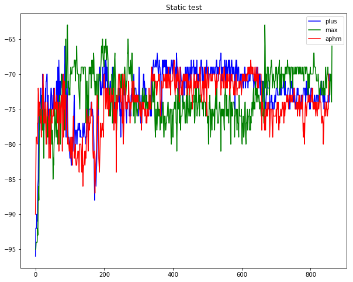

As discussed in the [Related Works](https://dymodi.github.io/Research/Beacon-Localization-Related-Works), the beacon signal suffers heavily from fluctuation. We tested three types of Beacon hardware. In the test, both the beacon and the cellphone are statical. The results are:

