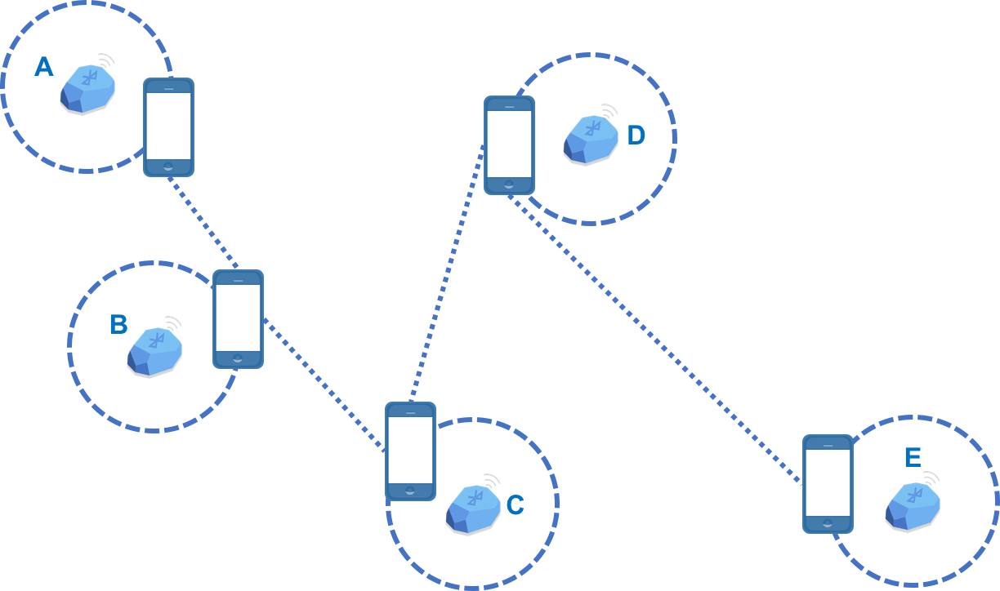

--- 
layout: post
title: Walking speed distribution
date: Sep. 22, 2017
author: Yi DING
---
[comment]: # (Indoor Walking Speed Distribution)

## Background and Related Work
Indoor walking speed distribution is an important topic in indoor localization and crowdsourcing. 

Some existing studies have shed light on this topic. In [1], normal distribution is used to fit the walking speed with mean value around 1.3 m/s. An article on [Wiki](https://en.wikipedia.org/wiki/Preferred_walking_speed) said that many people tend to walk at about 1.4 m/s. [2] also concludes a mean of 1.434 m/s for men based on 23,111 subjects. 

However, the existing studies suffers from small sample size and a accurate indoor environment. Moreover, the speed they estimate is for generic walking, which is different from delivery situation which time means money to those courier.

## Estimate Couriers' Indoor Walking Speed

### Data-set
In our study, we depolyed XX BLE beacons in XX large malls. Specific, we put a BLE beacon in each restaurant in these malls and gather data from the couriers' cellphone. Around 140,000 entries of data are gather from 300 couriers participated everyday and the experiment lasts for 1 month.

The raw data is in the following form:

|courier_id |timestamp              |beacon UUID    |beacon major   |beacon minor   |rssi   |
|---        |---                    |---            |---            |---            |---    |
|000001     |2017-09-20 18:00:00.0  |E2C....        |15102          |1501           |-80dB  |

When deploying the beacons, we also built a mapping for each beacon and its physical locations. The mapping has the following format:

|shop_id    |shop_name  |shop_latitude  |shop_longitude |beacon UUID    |beacon major   |beacon minor   |
|---        |---        |---            |---            |---            |---            |---            |
|000001     |Rice       |31.22222       |121.22222      |E2C....        |15102          |1501           |

The reason to use the shop's latitude and longitude instead of building a new coordinates is that each shop's latitude and longitude has been recorded in the database beforehand. Due the large scale of beacon deployment, it's not scalable to create new coordinates for each beacon.

### Estimate the walking speed

 

### 

## Ref.
[1] Chandra, S., & Bharti, A. K. (2013). Speed distribution curves for pedestrians during walking and crossing. Procedia-Social and Behavioral Sciences, 104, 660-667.

[2] Bohannon, R. W., & Andrews, A. W. (2011). Normal walking speed: a descriptive meta-analysis. Physiotherapy, 97(3), 182-189.