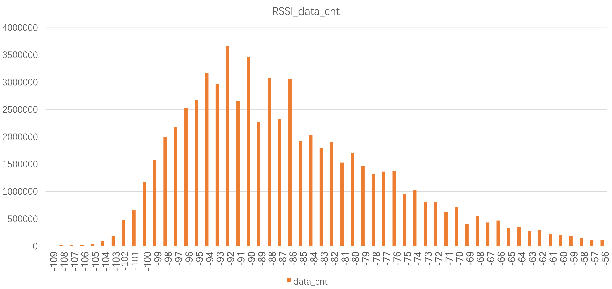
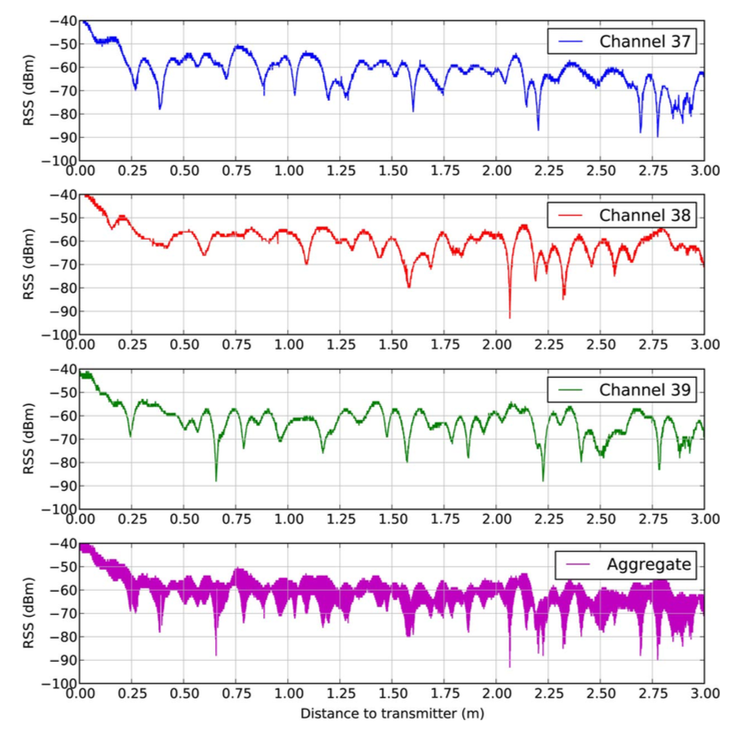

--- 
layout: post
title: Baisc Facts
date: Sep. 20, 2017
author: Yi DING
---
[comment]: # (Some basic facts about beaocn)

In this post we gather some basic facts on beacon both from Academia and Industry

## Range
According to [Wiki](https://en.wikipedia.org/wiki/IBeacon): "Standard beacons have an approximate range of 70 meters. Long range beacons can reach up to 450 meters"

According to [Bright Beacon](http://www.brtbeacon.com/main/maxbeacon.shtml), the product can coverage 100 meters.

## Proximity Definition
The funny thing is that different place give different definition of proximity:

|Zone       |Distance [1]       |Distance [Wiki]            |
|-------    |------             |------                     |
|Immediate  |<1m                |Within a few centimeters   |
|Near       |1-3m               |Within a couple of meters  |
|Far        |>3m                |Greater than 10 meters away|
|Unknow     |Device not ranged  | --                        |

Our experiment:

|RSSI(dB)   |Range      |
|---        |---        |
|>-65       |<1m        |
|-65~-75    |<5m        |
|-75~-85    |<10m       |

So we can conclude that RSSI > -65 indicates the distance < 1m, RSSI > -75 indicates the distance < 10m.
Or we can conclude that RSSI > -7 means that the rider is definitly within the range of the POI.

## RSSI - Distance Conversion
Many literature talks about the "path-loss" model when doing the conversion, which leads to the following equation [1][2]: 

$$ RSSI = -10n\log_{10}d + A $$
$$ d = 10^{(-RSSI+A)/10n} $$

where $A$ is the received RSSI in dB at one meter, $n$ is the path loss exponent that need to be fitted in different environment. The typical value of $n$ is 0.9116 and 1.246 in [1] and 1.3 in [2]. 
According to the [UTD slides](https://www.utdallas.edu/~torlak/courses/ee4367/lectures/lectureradio.pdf), typical value of $n$ is:

|Environment            |Path Loss exponent, $n$    |
|----                   |----                       |
|Free Space             |2                          |
|Urban Area             |2.7 to 3.5                 |
|Sububan Area           |3 to 5                     |
|Indoor (line-of-signt) |1.6 to 1.8                 |

## RSSI distribution
We gather the beacon data for all the rider in our experiment in one day. According to the data we gathered, the  rssi distribution is:

The CDF is as follows:

It can be seen that 99% of data falls between -105dB and -55dB.

## RSS variation with time (static devices)
According to [3], RSSI fluctuation is not negligible even for the static devices. The RSS variation with time (static device) is: (Figure from [3])

    

## RSS variation with distance (receiver moving)
When moving towards/away from beacons, the RSS received at the receiver suffers from fast fading. Which can be a major concern for either fingerprinting or trilateration. The RSS variation with distance (receiver moving) can be shown as: (Figure from [3])

    

## Ref.
[1] Zafari, F., Papapanagiotou, I., Devetsikiotis, M., & Hacker, T. (2017). An iBeacon based Proximity and Indoor Localization System. arXiv preprint arXiv:1703.07876.

[2] Subedi, S., Kwon, G. R., Shin, S., Hwang, S. S., & Pyun, J. Y. (2016, July). Beacon based indoor positioning system using weighted centroid localization approach. In Ubiquitous and Future Networks (ICUFN), 2016 Eighth Internat

[3] Faragher, R., & Harle, R. (2015). Location fingerprinting with bluetooth low energy beacons. IEEE journal on Selected Areas in Communications, 33(11), 2418-2428.
