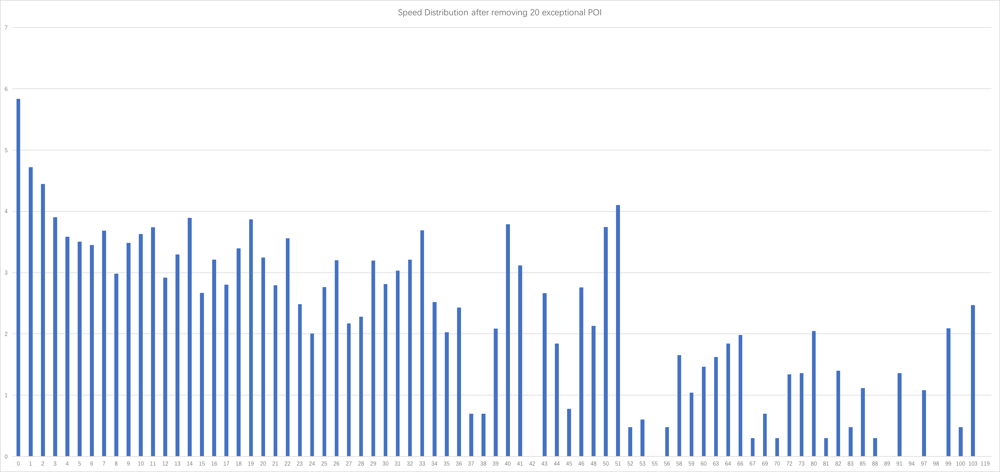

--- 
layout: post
title: POI Information Correction based on Beacon
date: Sep. 18, 2017
author: Yi DING
---
[comment]: # (The math equation in this post is for latex and can be viewed in Visual Studio Code)

[comment]: # (This post composite the POI Correction Section)


## Remarks
* Due to fast fading, distance estimation is not reliable in indoor environment.


## Design Space
The design space can be like the following:
* Anchor based localization/detection
* Anchor free localization/detection
    * Bidirectional communication based
    * Bidirectional communication free (Our Work) (We need to claim that we are the first.)

## Notation
$P$: The POI node set.

$n_P$: The number of nodes in the POI node set. $n_P=\left\lvert P \right\rvert$

$\text{lat}_i$: The accurate latitude of POI node $i\in P$.

$\text{lon}_i$: The accurate longitude of POI node $i\in P$.

$\hat{\text{lat}}_i$: The recorded latitude of POI node $i \in P$ in the database.

$\hat{\text{lon}}_i$: The estimated longitude of POI node $i \in P$ in the database.

$d_i$: The drifting distance of POI node $i$.

$d_P$: The average drifting distance of all the nodes in $P$.

## Basic Concept
**Arrive**: Receive a beacon signal with RSSI > -75dB

## Speed Distribution for Pedestrains during Walking
There are some studies on the human walking speed, 

According to [1], the walking speed for pedestrains follow


## The Metric for POI Accuracy
$$d_i=\sqrt{(\text{lat}_i-\hat{\text{lat}}_i)^2+(\text{lon}_i-\hat{\text{lon}}_i)^2}$$ 

$$d_P=\frac{1}{n_P}\sum_{i\in P}{d_i}$$

$d_P$ can be seen as a metric to measure the accuracy of the location information for a POI node set. 

## POI Exception Detection
[comment]: # (We need first define some metric to measure the exception)
Many BLE based indoor localization methods are using the **Path loss** equation to calculate the distance from receiver to the beacon according to the RSSI. However, the path loss exponent in the equation is subject to the indoor structure and environment. In their studies, they use a typical value or estimate the variable based on a small scale experiment, which is **not** applicable in our case since ebeacon will be depolyed to many different indoor environment.

//Because RSSI suffers from fluctuation and fast fading, we need a time window for smoothing.

We need the indoor speed distribution to find the exception POIs in the data base, we also need accurate POI information to calculate the speed distribution. Hence we consider the following procedure:

Maybe we can do this in two steps:

1. Preliminary detection using all speed samples.
2. Fine-grained detection using speed distribution with each POI pairs.

Preliminary detection procedure
```
While(There are exceptional speed sample in indoor speed distribution):
    Remove exceptional POI information from POI database;
    Calculate indoor speed distribution based on new POI database
```
Some pracitcal questions:
* How to define a exceptional speed sample
    * Answer: The greatest speed > 10m/s

* How to find the exceptional POI corresponding to the speed sample (Cause we have two)
    * Answer: the one that more frequent in exceptional pairs

The following figure is the original distribution using all the POIs:
<p align = "center">

</p>

Note: (1)Using ebeacon raw data; (2)>75dB is considered as at POI; (3) The y-axis is in log.

The following figure is the original distribution after remove 20 (10%) exceptional POIs:
<p align = "center">

</p>

The following figure is the original distribution after remove 30 (15%) exceptional POIs:
<p align = "center">

</p>

It seems that exceptional POIs and speed samples still exist after we remove 15% exception POIs. There are two possiblities: 
* We should remove more POIs.
* We need change the threshold we consider "arrive". 

For the second one, we can change the threshold from -75 to -70. But after trying, we found that the distribution is almost the same for the original one and the one after removing 30 exceptional POIs.

We use the following method to detect the 


## POI Correction
Basic Idea:
After we drop all the wrong POI information, we get it back one by on by solving an optimization at each time. The optimization goal is to minimize the exceptional speed distribution.


## Background
Many existing indoor localization methods are using the finger-printing strategy[][]. That is, a training phase is needed before indoor localization can be achieved, which is not pratical for large scale application. Some other studies 


## Motivation
[comment]: # (It will be better to have a small example and some figures)


## In-Field Experiment


[1] Chandra, S., & Bharti, A. K. (2013). Speed distribution curves for pedestrians during walking and crossing. Procedia-Social and Behavioral Sciences, 104, 660-667.