## The Object of Riders' Arrival Depature Detection
* ETA of Delivery
* Rider Cheating Detection
* POI Correction

What is the key information we need to know from RADD: The specific time of rider's arrival and departure at each POI.

## Difficulties in Real-time RADD
* Real-time, we cannot have a large window for filtering or pattern recognition
* Large-scale and diversity, a simple model won't work for all riders and shops.

## Why "Arrival/Departure Detection" instead of "Indoor Localization"
* Localization needs multiple beacon deivces installed nearby, which is not applicable in real world for large scale applcaition like city-range food delivery system.

* RSSI fluctuation (fast fading) makes BLE beacon not suitable for indoor localization. This is also supported by our experiment as well as Apple's claim in the technique report.

## Why not simple filtering
In the [beacon filtering blog](https://dymodi.github.io/Research/Beacon/Beacon-Filtering), we discuss the arrival and departure detection using filtering. However, this method is an off-line method based on the entire dataset. While in some scenarios, such as rider dispatching, we need **real time** information of people's arrival and departure at some indoor/outdoor environment.

In this post,  we discuss real time arrival departure detection using beacon RSSI data. We will illustrate several techniques to achieve this.

## Short range low pass filter

For the short range low pass filter method, we assign a low pass filter to each rider-shop-pair and move the filter as time goes on.

For a specific (rider, shop) pair, the raw RSSI values are as follows

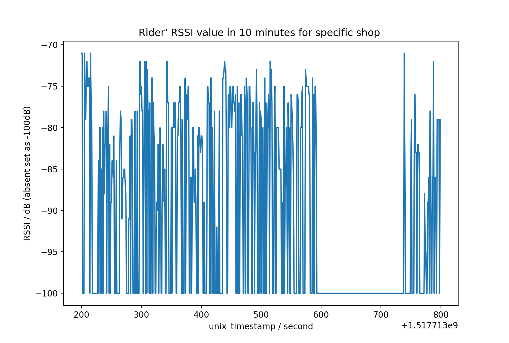

We can design a low pass filter based on what we have discussed in the [beacon filtering blog](https://dymodi.github.io/Research/Beacon/Beacon-Filtering).

Here we choose a digital Butterworth low-pass filter with the following form:

 
$$ G(z)=\frac{B(z)}{A(z)} = \frac{b(1)+b(2)z^{-1}+…+b(n+1)z^{-n}}{a(1)+a(2)z^{-1}+…+a(n+1)z^{-n}}  $$

We set the cutoff frequency as $$\omega_c=0.1$$ since the sampling frequency of the system is $$f_s=1\text{Hz}$$, we assume that signal changes faster than $$\omega_c$$ is due to fast fading but not human movements. The frequency response plot of the filter is as follows:

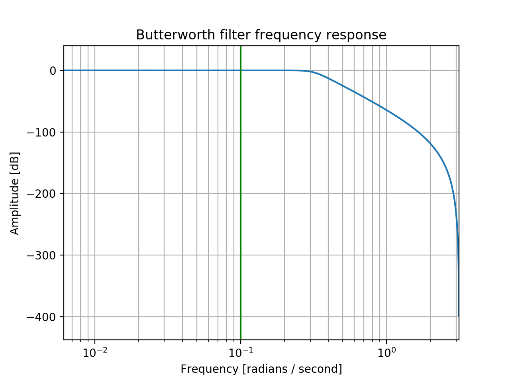

If we don't need the rider's real-time arrival/departure information, we can design an offline filter working on the entire dataset. The result will be like follows:

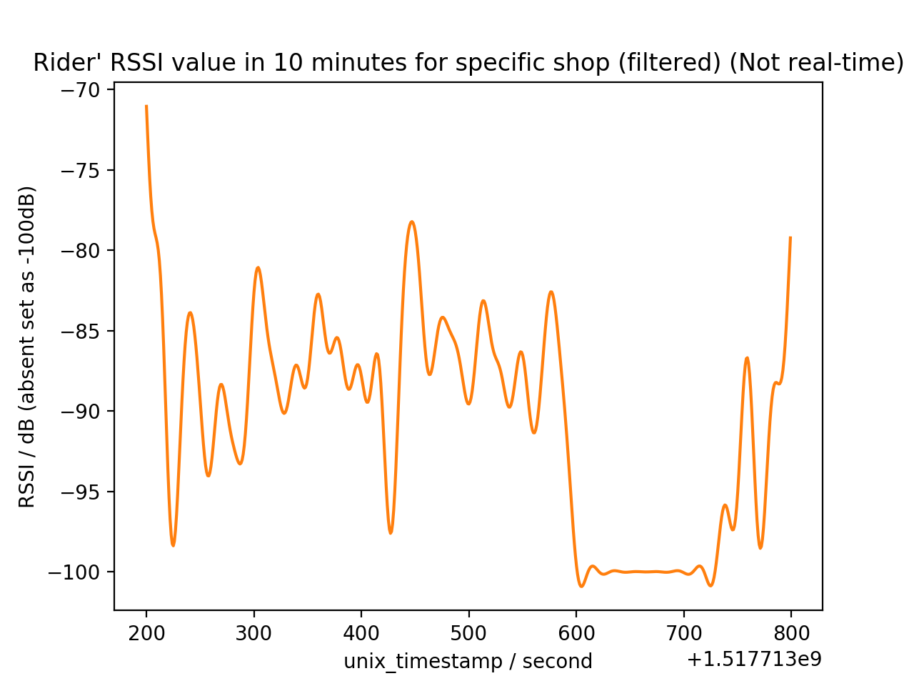

After the filter and shaving, the result are as follows:

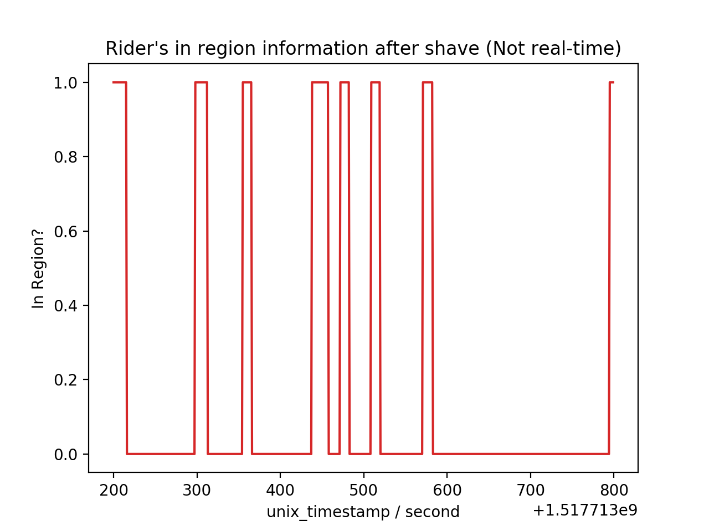

By introducing a short range moving window low pass filter (LPF),  we can set a window (say 30 seconds) and filter the RSSI value in the window and do the in-region recongnition and decide the arrival/departure momoments.

The real-time filtered RSSI values with short range LPF is as follows:

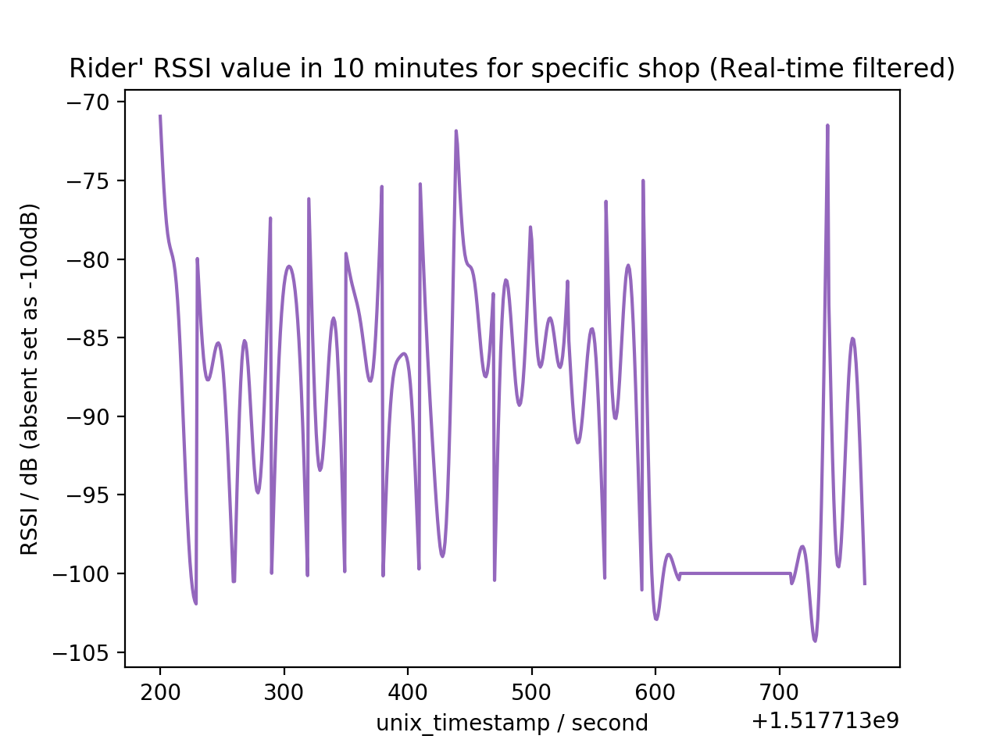

The result of in region detection is as follows:

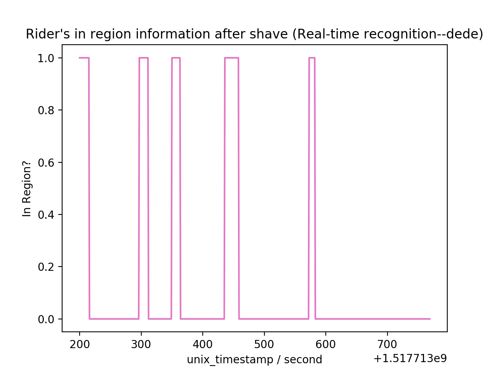

Compared to offline filtering, there are some performance degredation.

This method (moving window LPF) can give us an relative accurate method (compared with offline detection), but is too complicated to maintain for large system, given tens of thousands of riders and restaurants working at the same time. That is, we need some more light-weight application that can achieve arrival/departure detection.

## Light weight arrival/departure detection algorithm

One possiblity is single moving filter for one rider (but not rider-shop pair). Since we assume **the rider can only be at one shop at any time**.

The following is the figure of this rider's rssi with multiple near by shops.

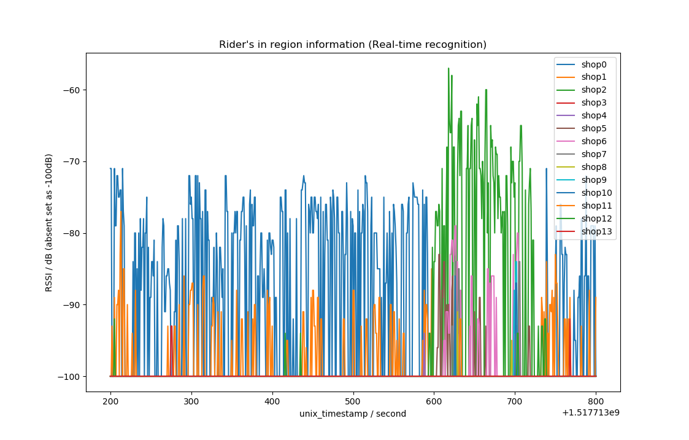

So the question becomes, how can we decide which shop is the rider in at each time instance. In order to do this, we might need to review some related works on BLE-based prescence detection.

## Bayesian Estimation on Rider's Arrival

Since the rider's position is dynamic and related to many POIs in real world, we can use the Bayesian estimation for the possiblity of rider's prescence in the around shops. 

Given the fast fading nature of BLE RSSI, it's diffcult to conclude that the rider is in or not in the shop, however, the signal strength does give us some information to measure the probablity  of rider in the shop. In this case, Bayesian updating would be a good choice to estimate the possiblity of rider's prescence in the shop. Historical information (in the short range) acts as prior while real-time information can be used to update the possibility.

We have the following hypotheses space:

$$\mathcal H = \{ O, S_1, S_2, …, S_n \}$$

where $$S_i$$ means the rider is in shop $$i$$, and $$O$$ means the rider is not in any shop (outdoors).

We have the following observations:

$$R_j: $$ The RSSI value heard from shop $$j$$.

What we want to compute is that for all the nearby shops: $$i\in\{1,2,…,n\}​$$, the values of $$\text{Pr}(S_i \mid R_j=r)​$$ given the real-time $$R_j=r​$$.

According to Bayes Rule, we have

$$\text{Pr}(S_i|R_j=r) = \frac{\text{Pr}(R_j=r|S_i)\text{Pr}(S_i)}{\text{Pr}(R_j=r)}$$

$$\text{Pr}(R_j=r) = \sum_i \text{Pr}(R_j=r|S_i)\text{Pr}(S_i) + \text{Pr}(R_j=r|O)\text{Pr}(O)$$

Also we have

$$\text{Pr}(O|R_j=r) = \frac{\text{Pr}(R_j=r|O)\text{Pr}(O)}{\text{Pr}(R_j=r)}$$

Which is equivlent to 

$$\text{Pr}(O|R=r) = \frac{\text{Pr}(R=r|O)\text{Pr}(O)}{\text{Pr}(R=r)}$$

since we don't care the received RSSI came from which shop when we are decide we are in or not in the shop.

Here $$\text{Pr}(R_i^j\mid S_i^j)$$ is called the likelihood. It has been studied in many literature that we can use a emperical equation to describe the relation between distance and RSSI. The relation can be described as follows:

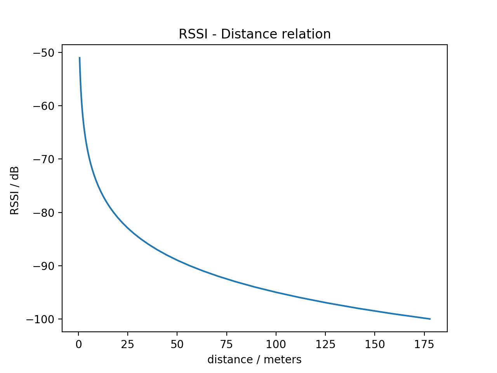

It seems that the higher the RSSI value is, the more near the rider is to the beacon (the more confident we can say that the rider is in the shop).

However, in reality, the emperical PDF of $$\text{Pr}(R_i^j \mid A_i^j)$$ is as follows. We collected 30,000 orders for the past 30 days and record the RSSI value when the rider labels himself as "Pickup Meal". 

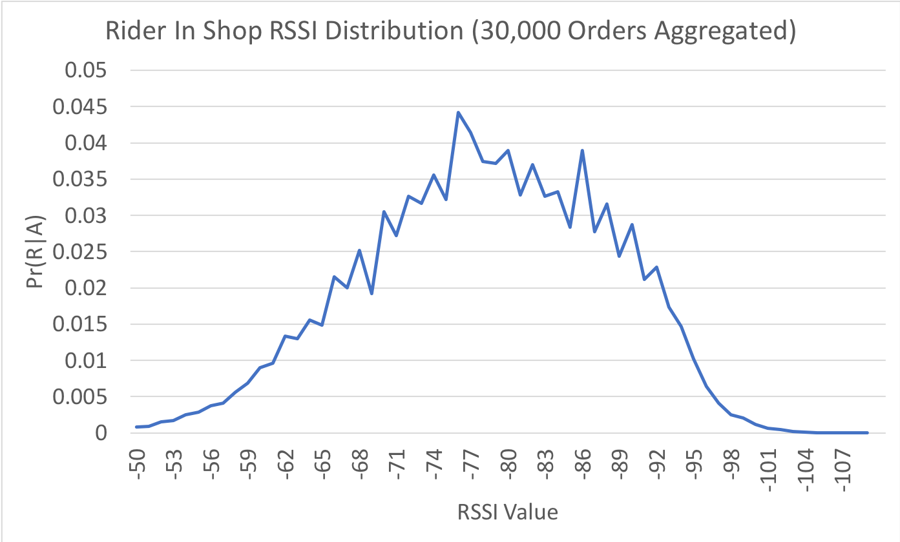

It seems that the center is around -77dB and higher RSSI value is less observed. One reason is that due to placement (attached on ceiling), the rider usually cannot get very close to the beacon (<3m), hence the center is around -77dB. 

Hence the question becomes, we should use which distribution as our $$\text{Pr}(R_i^j\mid A_i^j)$$, the theoratical result from literature or the emperical distribution from data.

One another question is, if we use emperical PDF, weather we should use a global distribution for all shops or we should build unique model for each shop. Here we have two emperical distribution from two shops' data.

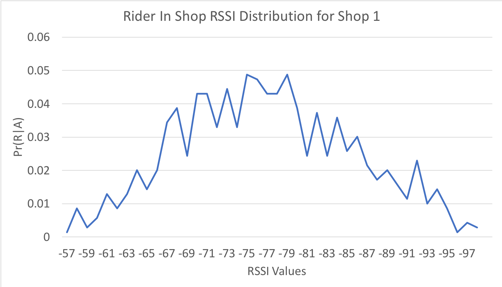
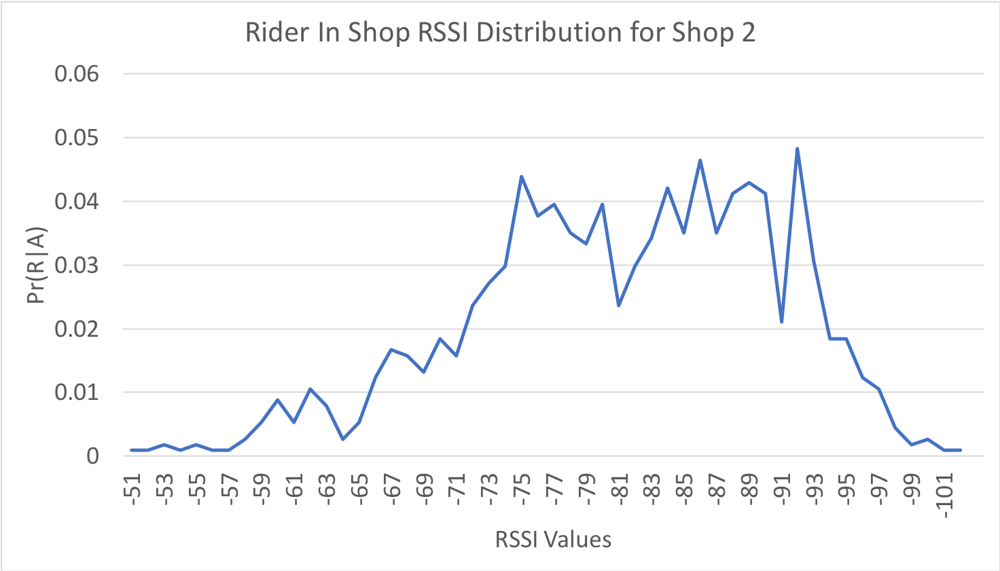

For online detection, prior $$\text{Pr}(A_i^j)$$ is the posterior in the last time instance, i.e. our estimation so far. 

## Getting Ground Truth from Riders' Labeling Data

In our experiments, the riders are required to report the progress of the delivery by manully click "Arrival at Restaurant" and "Pick up meal"on his cellphone. We consider the timestamp of the above two events as the arrival and departure time of the rider. The duration between arrival and departure is considered as "In the Restaurant".

In an ideal case, the meal is already prepared and ready to pick before the rider came. The rider only needs to pass by a sequence of shops and the arrival/departure behavior can be visualized as follows where a rising edge indicates "Arrival" and a falling edge indicate "Departure".

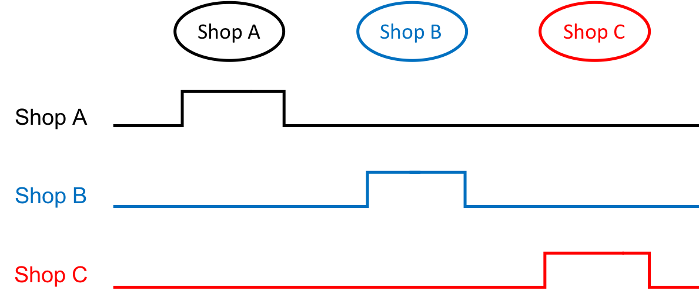

While a more complex case can be follows:

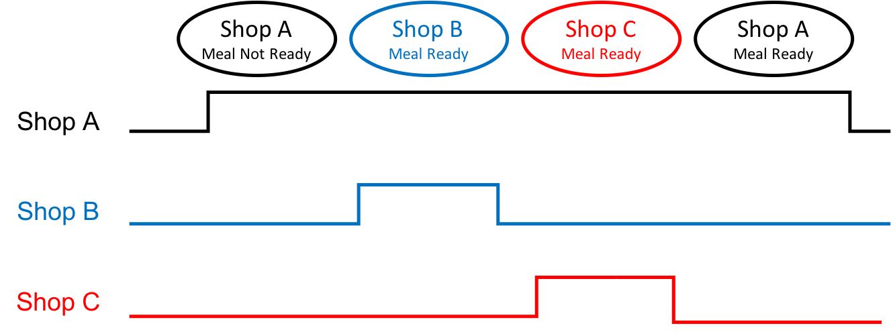

### Some Inconsistency Between RADD Results and Riders' Labelling

Redundant Arrival/Departure

