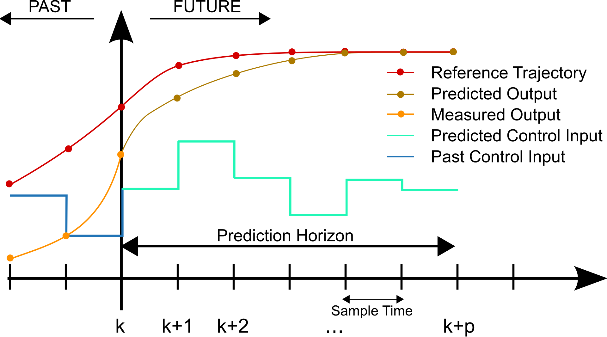

Here we gave a gentle intro to model predictive control (MPC). Some contents comes from Prof. Alberto Bemporad's [slides](http://cse.lab.imtlucca.it/~bemporad/teaching/ac/pdf/AC2-10-MPC.pdf) at IMT Lucca.

## Basic Idea

According to Prof. Alberto Bemporad, the core idea of MPC is "Use a dynamical **model** of the process to **predict** its future evolution and optimize the **control** signal."

Specifically, at time $t$: solve an optimal control problem over a finite future horizon of $N$ steps:

$$\begin{align} \min_u \quad &\sum_{k=0}^{N-1} || y_{t+k}-r(t) ||^2+\rho||u_{t+k}||^2  \\ \text{s.t.} \quad &x_{t+k+1} = f(x_{t+k},u_{t+k})  \\ &y_{t+k} = g(x_{t+k}) \\ &u_{\text{min}} ≤ u_{t+k} ≤ u_{\text{min}} \\ &y_{\text{min}} ≤ y_{t+k} ≤ y_{\text{min}} \\ & x_t = x(t), k =0,...,N − 1 \end{align}$$

After the optimization at each step, only the first optimal move $u^*(t)$ is applied.

At time $t+1$: Get new measurements, repeat the optimization. And so on … A simple illustration of the process can be found in the figure below.

 

The advantage of repeated on‐line optimization is FEEDBACK, which is one of the core parts in control.

## Constrained Optimal Control

In MPC, we are actually solving a constrained optimization at each step. We consider a linear model:

