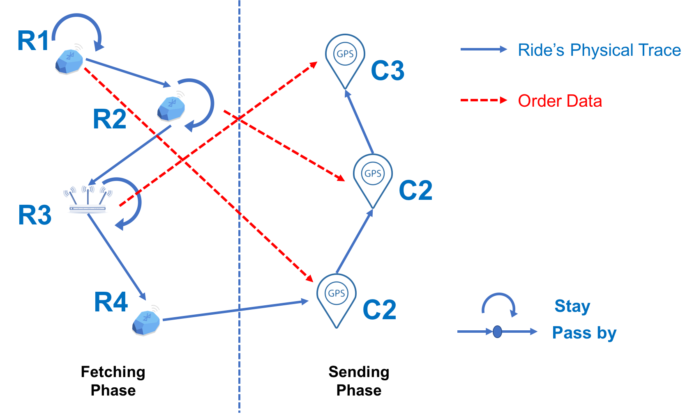

--- 
layout: post
title: Delivery Mechanism
date: Oct. 17, 2017
author: Yi DING
---

[comment]: # (This post introduce the delivery mechanism of food delivery system)

# Delivery Mechanism of Food Delivery System

This post introudce the mechanism of the food delivery system.

## The Basic Component of the Delivery
Here we use a **batch** to describe the basic unit of the delivery process. In a batch, there are two phases: fetching phase and sending phase. As shown in Figure 1.

### The Order State
There are XX types of state for an order in the system: "Order Accepted (OA)","Waiting for Picking up (WP)", "Rider Arrived (RA)", "Under Delivering (UD)", and "Order Delivered (OD)"

### Batch Data Clustering
Although each rider will take several orders as a batch, the data for each order is kept individually in the database. 
We have the following data sources: 
* Event time data: for each order delivery task, the time of the event that cause order state change.
* Outdoor tracking data: the rider's outdoor location data from GPS.
* Indoor tracking data: the rider's indoor location data from beacon and Wi-Fi.

The concept is shown in Figure 2.

A **first practical problem** is that we need to know when the rider is in fetching phase and when the rider is in sending phase. We can cluster the order batch as the following figure fashion:

Hence in order to mine the rider's mobility pattern, we need to fuse the data and organize the data in the following format:
|Rider ID   |Batch ID   |Order Number   |Order ID   |Restaurant ID  |Rider Arrive Time  |Rider Leave Time   |

