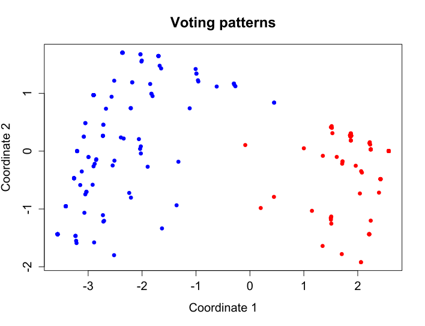

--- 
layout: post
title: Related Works of MDS
date: Oct. 12, 2017
author: Yi DING
---

[comment]: # (This is a review of MDS-related paper)

Original MDS is a nonlinear dimensionality reduction method that inputs distance matrix and outputs the coordinates of the objects ([Wiki](https://en.wikipedia.org/wiki/Multidimensional_scaling)). An example is the "Voting patterns in the United States House of Representatives" in Figure 1. 

Figure 1. An example of original MDS: Voting pattern (Figure from Wiki).

## MDS used in Sensor Network
In paper [1], they propose the method MDS-MAP that can conduct the localization of the sensors with only connectivity information. Paper [2] is a improved version of MDS-MAP that works well even in the irregularly-shaped network.

## Ref.
[1] Shang, Y., Ruml, W., Zhang, Y., & Fromherz, M. P. (2003, June). **Localization from mere connectivity**. In Proceedings of the 4th ACM international symposium on Mobile ad hoc networking & computing (pp. 201-212). ACM.
[2] Shang, Y., & Ruml, W. (2004, March). **Improved MDS-based localization**. In INFOCOM 2004. Twenty-third AnnualJoint Conference of the IEEE Computer and Communications Societies (Vol. 4, pp. 2640-2651). IEEE.