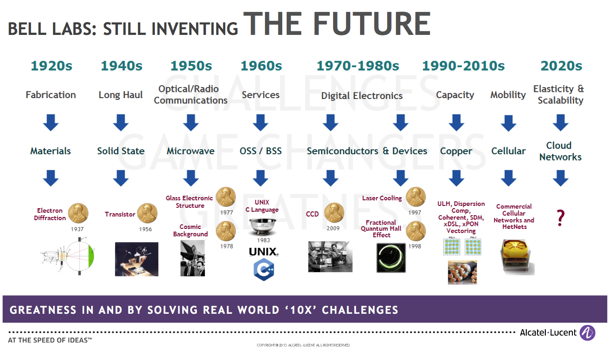

This is a course note of UCSD's Coursera: [*Internet of Things: How did we get here?*](https://www.coursera.org/learn/internet-of-things-history/home/welcome)

 

### Welcome

Two demos are shown: Sonification of Movement and Healthcare Remote Monitoring, which demonstrates the simple mechanism as well as the huge potential of IoT technology.

An interesting part is that Snapdragon is advocated in the lecture and Qualcomm gets involved.

### Module 1 (Circuit Switch)

#### Lesson 1 - Telephony Networks

Star shape network. Invention of Triode.

#### Lesson 2 - Broadcast Networks

The story between Lee de Forest, Edwin Howard Armstrong and David Sarnoff is quite attractive.

#### Lesson 3 - AT&T Innovations

Some innovations from AT&T (Bell Labs): Information Theory, Transistor, C and UNIX.

#### Lesson 4 - Rise and Fall of AT&T

Lawsuit from the Department of Justice and Monopoly of AT&T.

### Module 2 (Packet Switch)

#### Lesson 1 The Internet Initiative

ARPA net and IETF

#### Lesson 2 Reliable Services

Email and browser.

#### Lesson 3 Realtime Services

VoIP and Multicast.

### Module 3 (Computer Telephony)

#### Lesson 1 Telephony goes digital

Data plane and control plane

[Companding](https://en.wikipedia.org/wiki/Companding) is a very useful tool in data plane to reduce the dynamic of signal while transmiting.

#### Lesson 2 Shifting Landscapes

#### Lesson 3 So, what's the Big Deal!

#### Lesson 4 A Word of Caution!

Dial tone. 911 Fiasco.

### Module 4 (Wireless Technologies)

#### Lesson 1 Teleophony goes Wireless

The failure story of AT&T and McKinsey

#### Lesson 2 Mobility and the Control Plane

The SS7 can be use in cellphone network to achieve mobility.

Why cellphone market goes beyond expectation: one reason is prepaid phone which credits to a well designed billing system.

#### Lesson 3 Air Interface (1G, 2G, 3G and 4G)

How to maintain so many communications:

* Get more spectrum

* Improve Spectural Efficiency (TDMA, CDMA)

* Reduce data rate for each voice call (LPC)

3G and 4G

#### Lesson 4 Radios, Radios, and Radios

