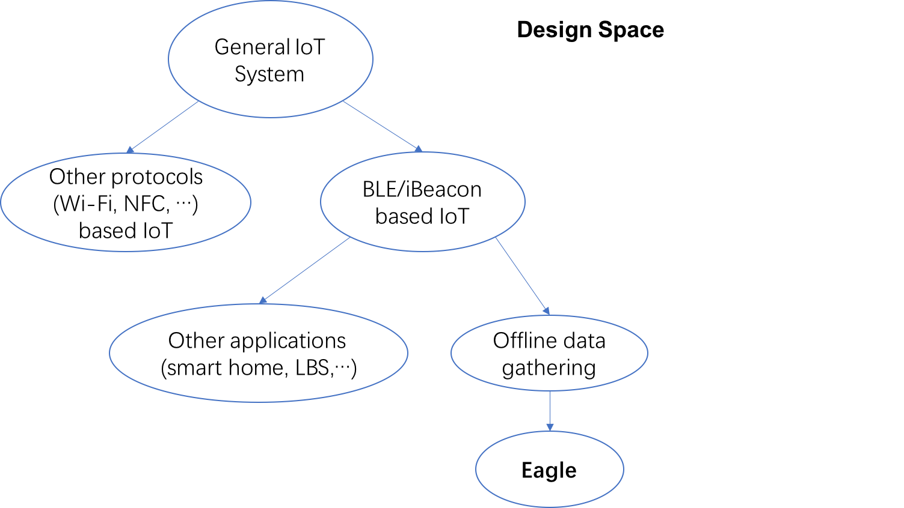

--- 
layout: post
title: Related Works of Offline Data Collecting
date: Nov. 27, 2017
author: Yi DING
---

[comment]: # (Related Works of Offline Data Collecting)

## "Related Work" Section for paper "Eagle"

**Online data gathering** ...[2]

Offline data gathering is much more challenging than online data collecting due to many factors. Some researchers tried to tackle the problem from different viewpoints in recent years: a cyber-physical- human system (CPHS) framework is proposed in [1]. Leaks in the water network can be localized based on sensing data, geophysical data, human input, and simulation/modeling engines.

Green IoT is an attractive research topic in recent years due to large energy consumption in the deployment and operation prcess of the large scale IoT system. Green IoT can be achieved in many aspects. Energy-efficiency oriented optimization can be conducted in the deployment phase as well as the operation phase [3]. In another aspect, IoT system can be utilized to monitor the environment parameters and save energy in the Smart City frame [6].

Secure IoT issues are also becoming improtant as more and more IoT devices are deployed in the real world. The necessity of secure IoT is discussed in [7][8]. It has been proven that traditional security technologies are not applicable in the large scale IoT system [8]. A local plug-in is introduced in [7] so that security mechanism can be implemented before the data is uploaded to the cloud [7]. 

### Design Space

## Individual Review

### Offline data gathering
[1] provides an example frame for gathering offline data from heterogeneous data sources and fusing them for a specific purpose. 

It is stated in [1] that "The installation of IoT devices is time consuming and expensive; furthermore their measurements are subject to uncertainty due to sensing errors and measurement correlations. To abstract out correct information with limited IoT observations in a timely manner, sophisticated and high performance algorithms are required."

[5] introduces an integrated operating system: VITAL-OS that can work with multiple IoT scenarios to provide a unified platform to monitor, visualize, and control all the operations of in the Smart City environment.

### BLE/iBeacon based IoT/LBS

Network structure: BLE mesh network is proposed in [16] to achieve for power-limited and low-complexity IoT applications with low-priority and infrequent data traffic.

As a industrial accepted protocal, current research on iBeacon mainly focus on indoor positioning and navigation [][][], occupancy detection [9] and group formations detection [10]. **Much can be done with current iBeacon system**.

Other application of BLE/iBeacon are: 
* Art Museum: [11], 
* Smart home: [12], [13],
* Smart Vehicles: [17],
* Data gathering: [14],

A very similar topic is [14], iBeacon (embedded with some other sensors) are used as sensor nodes to collect environment data such as temperature and humidity. The data gathered is  uploaded to the BigData ecosystem. However, many practical problems (deployment, data fusing, inconsistency resolving) are not handled in the paper. 

### Green IoT
[3] provides a hierarchical system framework for a general IoT deployment and the model is optimized to achieve green IoT. A very simple but elegant summary of "what is IoT" is proivded in the Introduction part. A cost-effective deployment scheme is introduced in the paper.

[4] provides little new things in Green IoT. A relative complete but not very well written survey of "energy efficient IoT" is provided in the Introduction section. 

The design and implementation of a practical IoT system is described in [6]. The main function of the system is to monitor the energy consumption and environment parameters.

### Secure IoT/BLE
It has been demonstrated in [15] that "BLE devices that relies on BLE security has weak communication security". A private-key encryption algorithm is proposed in [15] to solve the  security problem.

A very impressive description of "why we need secure IoT" is provided in the [7]. The paper claims that "concern over data privacy arising from the over-centralization of IoT systems is a critical obstacle to their growth."  A local plug-in is introduced to conduct privacy protecting mechainsm before the data is upload to the cloud.

The importance of IoT security is also discussed in [8] with some IoT attacks reported already. The authors also argue that conventional security technologies are not applicable in the IoT system. However, a corresponding solution is not provided in the paper.

## Ref.
[1] Han, Q., Nguyen, P., Eguchi, R. T., Hsu, K. L., & Venkatasubramanian, N. (2017, June). **Toward An Integrated Approach to Localizing Failures in Community Water Networks**. In Distributed Computing Systems (ICDCS), 2017 IEEE 37th International Conference on (pp. 1250-1260). IEEE. 
[IEEE Xplore](http://ieeexplore.ieee.org.ezp1.lib.umn.edu/stamp/stamp.jsp?tp=&arnumber=7980065&tag=1)

[2] Sadri, M., Mehrotra, S., & Yu, Y. (2016, October). **Online Adaptive Topic Focused Tweet Acquisition**. In Proceedings of the 25th ACM International on Conference on Information and Knowledge Management (pp. 2353-2358). ACM.

[3] Huang, J., Meng, Y., Gong, X., Liu, Y., & Duan, Q. (2014). **A novel deployment scheme for green internet of things**. IEEE Internet of Things Journal, 1(2), 196-205.

[4] Routray, S. K., & Sharmila, K. P. (2017, February). **Green initiatives in IoT**. In Advances in Electrical, Electronics, Information, Communication and Bio-Informatics (AEEICB), 2017 Third International Conference on (pp. 454-457). IEEE.

[5] Petrolo, R., Roukounaki, A., Loscri, V., Mitton, N., & Soldatos, J. (2016, June). **Connecting physical things to a SmartCity-OS**. In Sensing, Communication and Networking (SECON Workshops), 2016 IEEE International Conference on (pp. 1-6). IEEE.

[6] Amaxilatis, D., Chatzigiannakis, I., Mylonas, G., Pocero, L., Zarras, D., & Koskeris, A. (2015, October). **Green mindset: using IoT to promote energy efficiency and sustainability in Greek public schools**. In Proceedings of the 19th Panhellenic Conference on Informatics (pp. 297-302). ACM.

[7] Davies, N., Taft, N., Satyanarayanan, M., Clinch, S., & Amos, B. (2016, February). **Privacy mediators: Helping iot cross the chasm**. In Proceedings of the 17th International Workshop on Mobile Computing Systems and Applications (pp. 39-44). ACM.

[8] Yu, T., Sekar, V., Seshan, S., Agarwal, Y., & Xu, C. (2015, November). **Handling a trillion (unfixable) flaws on a billion devices: Rethinking network security for the internet-of-things**. In Proceedings of the 14th ACM Workshop on Hot Topics in Networks (p. 5). ACM.

[9] Corna, A., Fontana, L., Nacci, A. A., & Sciuto, D. (2015, March). **Occupancy detection via iBeacon on Android devices for smart building management**. In Proceedings of the 2015 Design, Automation & Test in Europe Conference & Exhibition (pp. 629-632). EDA Consortium.

[10] Katevas, K., Haddadi, H., Tokarchuk, L., & Clegg, R. G. (2016, September). **Detecting group formations using iBeacon technology**. In Proceedings of the 2016 ACM International Joint Conference on Pervasive and Ubiquitous Computing: Adjunct (pp. 742-752). ACM.

[11] Cui, B., Zhou, W., Fan, G., & Wu, Y. (2017, August). **Smart mobile APP of museum—Investigations and design for local culture protection**. In Computer Science and Education (ICCSE), 2017 12th International Conference on (pp. 38-41). IEEE.

[12] Mirri, S., Prandi, C., Salomoni, P., & Monti, L. (2016, November). **Social Location Awareness: A Prototype of Altruistic IoT**. In New Technologies, Mobility and Security (NTMS), 2016 8th IFIP International Conference on (pp. 1-5). IEEE.

[13] Park, M., Song, Y., Lee, J., & Paek, J. (2016, October). **Design and Implementation of a smart chair system for IoT**. In Information and Communication Technology Convergence (ICTC), 2016 International Conference on (pp. 1200-1203). IEEE.

[14] Srinivasan, V. S., Kumar, T., & Yasarapu, D. K. (2016, May). **Raspberry Pi and iBeacons as environmental data monitors and the potential applications in a growing BigData ecosystem**. In Recent Trends in Electronics, Information & Communication Technology (RTEICT), IEEE International Conference on (pp. 961-965). IEEE.

[15] Thomas Chiu, David Calero Luis, and Vinesh Jethva. 2017. **Internet of Things BLE Security**. In Proceedings of the 6th Annual Conference on Research in Information Technology (RIIT '17). ACM, New York, NY, USA, 37-37. DOI: https://doi.org/10.1145/3125649.3125656

[16] Xiaokun Yang and Xianlong He. 2017. **Establishing a BLE mesh network with fabricated CSRmesh devices: demo abstract**. In Proceedings of the Second ACM/IEEE Symposium on Edge Computing (SEC '17). ACM, New York, NY, USA, Article 34, 2 pages. DOI: https://doi.org/10.1145/3132211.3132460

[17] Afonso, J. A., Sousa, R. A., Ferreira, J. C., Monteiro, V. D. F., Pedrosa, D. D. R., & Afonso, J. L. (2017). **IoT system for anytime/anywhere monitoring and control of vehicles’ parameters**.