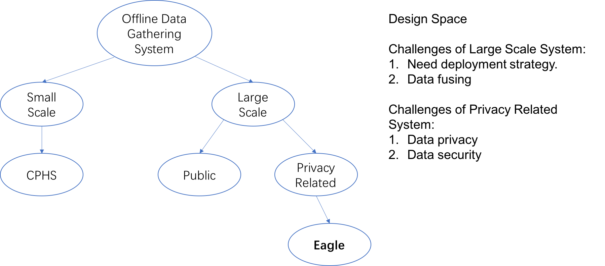

--- 
layout: post
title: Related Works of Offline Data Collecting
date: Nov. 27, 2017
author: Yi DING
---

[comment]: # (Related Works of Offline Data Collecting)

## "Related Work" Section for paper "Eagle"

Online data gathering ...[2]

Offline data gathering is much more challenging than online data collecting due to many factors. Some researchers tried to tackle the problem from different viewpoints in recent years: a cyber-physical- human system (CPHS) framework is proposed in [1]. Leaks in the water network can be localized based on sensing data, geophysical data, human input, and simulation/modeling engines.

[5]

Green IoT ... [3][4][6]

Secure IoT... [7][8]

### Design Space

## Individual Review

[1] provides an example frame for gathering offline data from heterogeneous data sources and fusing them for a specific purpose. 

It is stated in [1] that "The installation of IoT devices is time consuming and expensive; furthermore their measurements are subject to uncertainty due to sensing errors and measurement correlations. To abstract out correct information with limited IoT observations in a timely manner, sophisticated and high performance algorithms are required."

[5] introduces an integrated operating system: VITAL-OS that can work with multiple IoT scenarios to provide a unified platform to monitor, visualize, and control all the operations of in the Smart City environment.

## Ref.
[1] Han, Q., Nguyen, P., Eguchi, R. T., Hsu, K. L., & Venkatasubramanian, N. (2017, June). **Toward An Integrated Approach to Localizing Failures in Community Water Networks**. In Distributed Computing Systems (ICDCS), 2017 IEEE 37th International Conference on (pp. 1250-1260). IEEE. 
[IEEE Xplore](http://ieeexplore.ieee.org.ezp1.lib.umn.edu/stamp/stamp.jsp?tp=&arnumber=7980065&tag=1)

[2] Sadri, M., Mehrotra, S., & Yu, Y. (2016, October). **Online Adaptive Topic Focused Tweet Acquisition**. In Proceedings of the 25th ACM International on Conference on Information and Knowledge Management (pp. 2353-2358). ACM.

[3] Huang, J., Meng, Y., Gong, X., Liu, Y., & Duan, Q. (2014). **A novel deployment scheme for green internet of things**. IEEE Internet of Things Journal, 1(2), 196-205.

[4] Routray, S. K., & Sharmila, K. P. (2017, February). **Green initiatives in IoT**. In Advances in Electrical, Electronics, Information, Communication and Bio-Informatics (AEEICB), 2017 Third International Conference on (pp. 454-457). IEEE.

[5] Petrolo, R., Roukounaki, A., Loscri, V., Mitton, N., & Soldatos, J. (2016, June). **Connecting physical things to a SmartCity-OS**. In Sensing, Communication and Networking (SECON Workshops), 2016 IEEE International Conference on (pp. 1-6). IEEE.

[6] Amaxilatis, D., Chatzigiannakis, I., Mylonas, G., Pocero, L., Zarras, D., & Koskeris, A. (2015, October). **Green mindset: using IoT to promote energy efficiency and sustainability in Greek public schools**. In Proceedings of the 19th Panhellenic Conference on Informatics (pp. 297-302). ACM.

[7] Davies, N., Taft, N., Satyanarayanan, M., Clinch, S., & Amos, B. (2016, February). **Privacy mediators: Helping iot cross the chasm**. In Proceedings of the 17th International Workshop on Mobile Computing Systems and Applications (pp. 39-44). ACM.

[8] Yu, T., Sekar, V., Seshan, S., Agarwal, Y., & Xu, C. (2015, November). **Handling a trillion (unfixable) flaws on a billion devices: Rethinking network security for the internet-of-things**. In Proceedings of the 14th ACM Workshop on Hot Topics in Networks (p. 5). ACM.