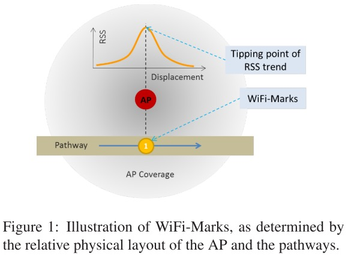
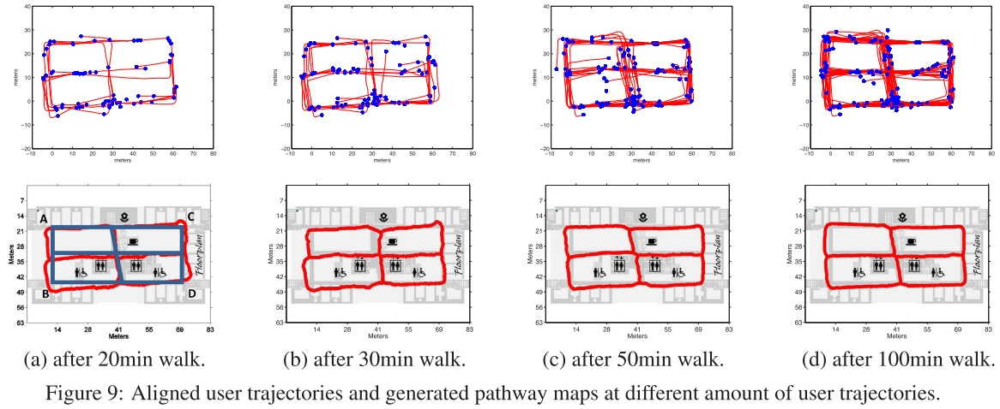
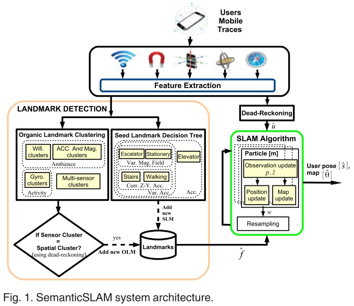
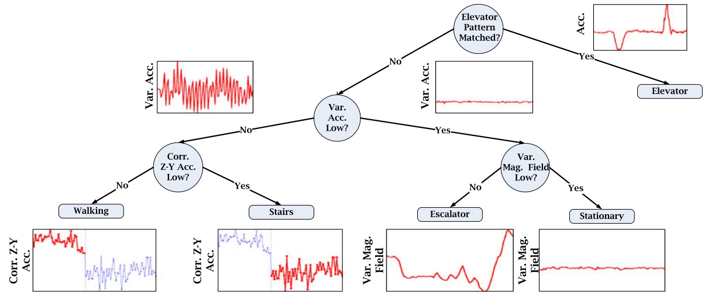

Landmark detection is somewhat similar to context sensing as I summarized [here](https://dymodi.github.io/Research/Literature-Reviews/Sensing/Scene-Ambience-Sensing-Monitoring-Related-Works).

The idea of using landmark/ambience attributes for localization can be traced back to works in 2009 [MobiCom-09].

A landmark is defined by two attributes: its **sensors pattern** and **physical location**.

Two types of landmarks are differentiated: **Seed Landmark** (**SLM**, both location and pattern are known, like elevator), and **Organic Landmark** (**OLM**, attributes unknown, genereted, like Wi-Fi set).

Whether the floorplan is known is critical. For example, if the floorplan is known, locations like doors, elevators, staircases, escalators might be easily detected and utilized as seed landmarks.

Acoustic landmarks are discussed in [MobiSys-11-ABS, MobiCom-16-Dolphin] and image landmarks are discussed in [MobiCom-14-Jigsaw]. Since acoustic and image data are not ubiquitously available from smartphones APPs, they are not listed in this survey.

**Keyword**

* Environment Landmarks
* Ambience
* Logical localization

**Taxonomy**

* Landmark type: 
  * (Seed landmark, readily with floorplan) Elevator, Escalator, Stairs
  * (Organic landmark, need clustering/training) Wi-Fi AP set, Cellular dead point, Light, Acoustic
* Data source: Wi-Fi, Magnetic, Gyro, Rotation, Compass, Light, Acoustic
* Detection method: SLAM(Simultaneous Localization And Mapping, EKF in fact), Fingerprinting

**Comments**

* Some seed landmarks can be acquired easily (elevator/etc.)
* New (organic) landmarks can be found via sensor data clustering.
* Machine learning can be used to train the model between landmark location and pattern.
* Dead-Reckoning or SLAM can be used for localization between landmarks, and can also be used to correct the landmark model (database).

**Technical Tricks**

* Layered model instead of a huge model.
* Initial motion classification (staric/esclator v.s. walk) according to velocity.
* Moving average window used to remove floor noise for accelerometer data. [MobiCom-09-SurroundSense]
* Use RSSI differences between different Wi-Fi but not absolute RSSI value as fingerprints. [IEEE-12-WILL]
* Walking direction and the turning angles can be obtained from magnetometer and the gyroscope. [NSDI-13-Walkie-Markie]

**Paper**

* SurroundSense, *MobiCom-09-Surroundsense*
  * Early works that claims ambience attributes (light/photo/acoustic/acc) can be used for localization.
  * Fingerprinting methods.
  * Te sensor and method might be outdated but the idea is worth learning.
  
* UnLoc, *MobiSys-12-UnLoc*
  * Similar idea as *SurroundSense*, while no war-driving or floorplan is needed.
  * Method: Landmark+Dead reckoning+WiFi-based partitioning (Iterative enlarge OLM database)

  

  
  

* WILL: Wireless Indoor Localization without Site Survey, *IEEE-12-WILL*
  * Data source: Wi-Fi, Accelerometer
  * Room-level Wi-Fi landmark is discussed in detail in this paper. The key idea is that different room has different Wi-Fi fingreprints.
  * Floorplan is not needed. "Virtual room"  is used to build a "logical floorplan".

  

  
    
  

* Walkie-Markie, *NSDI-13-Walkie-Markie*
  
  * Wi-Fi landmarks.
  * The key idea is the Wi-Fi RSS increase and descries along the pathway.
  * Displacement between WiFi-Marks is estimated from user trajectories by accumulating the displacement of each step.
  * Pathway map is generated through an expansion and shrinking procedure.
  
    

    
    

  

  

* SemanticSLAM, *TMC-16-SemanticSLAM*
  * Two types of landmarks are differentiated: seed landmark (both location and pattern are known), and organic landmark (attributes unknown).
  * Groundtruth is needed to detect the organic landmarks.
  * The system architecture can be found as follows:
  * Clustering can be used to find organic landmarks and decision tree (ML) can be used to locate the seed landmark.
  * Decesion tree seems to be a more accountable model for landmark detection. (Although decision tree may have limitation for heterogeneous devices, it is more explainable than neural network models)
  
  

  
  

    

    
  

##  Ref.

[MobiCom-09-Surroundsense] Azizyan, M., Constandache, I., & Roy Choudhury, R. (2009, September). Surroundsense: mobile phone localization via ambience fingerprinting. In *MobiCom* (pp. 261-272).

[MobiSys-11-ABS] Tarzia, S. P., Dinda, P. A., Dick, R. P., & Memik, G. (2011, June). Indoor localization without infrastructure using the acoustic background spectrum. In *MobiSys* (pp. 155-168).

[MobiSys-12-UnLoc] Wang, H., Sen, S., Elgohary, A., Farid, M., Youssef, M., & Choudhury, R. R. (2012, June). No need to war-drive: Unsupervised indoor localization. In *MobiSys* (pp. 197-210).

[IEEE-12-WILL] Wu, C., Yang, Z., Liu, Y., & Xi, W. (2012). WILL: Wireless indoor localization without site survey. *IEEE Transactions on Parallel and Distributed Systems*, *24*(4), 839-848.

[NSDI-13-Walkie-Markie] Shen, G., Chen, Z., Zhang, P., Moscibroda, T., & Zhang, Y. (2013). Walkie-Markie: Indoor pathway mapping made easy. In *NSDI* (pp. 85-98).

[MobiCom-14-Jigsaw] Gao, R., Zhao, M., Ye, T., Ye, F., Wang, Y., Bian, K., ... & Li, X. (2014, September). Jigsaw: Indoor floor plan reconstruction via mobile crowdsensing. In *MobiCom* (pp. 249-260).

[MobiCom-16-Dolphin] Wang, Q., Ren, K., Zhou, M., Lei, T., Koutsonikolas, D., & Su, L. (2016, October). Messages behind the sound: real-time hidden acoustic signal capture with smartphones. In *MobiCom* (pp. 29-41).

[TMC-16-SemanticSLAM] Abdelnasser, H., Mohamed, R., Elgohary, A., Alzantot, M. F., Wang, H., Sen, S., ... & Youssef, M. (2015). SemanticSLAM: Using environment landmarks for unsupervised indoor localization. *IEEE Transactions on Mobile Computing*, *15*(7), 1770-1782.