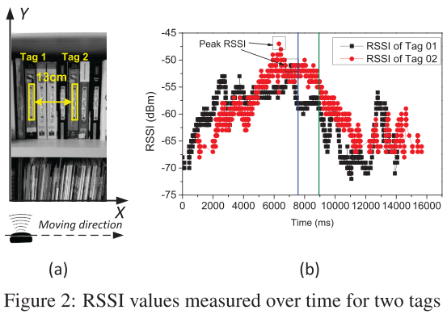

**Key Words:** Relative Localization

**Taxonomy**

* **Theoretical** (focus on mathmatical problem and proof) / **Technical** (focus on implementation and applications)
* **Centralized** (a server aggregate information and calculate locations for targets) / **Distributed** (target calculate locations on their own)
* Range-based / Range-free
* Ranging Methods: Acoustic, Wi-Fi, BLE, ZigBee, Light

**Comments**

* It seems that relative localization is a related topic to cooperative/collaborative localization. 

**Papers**

* Robust Distributed Network Localization with Noisy Range Measurements, *[SenSys 2004]*
  * **Taxonomy:** Distributed, Acoustic
  * **Contributions:** The main contribution is to estimate relative locations in presence of ranging noises. 
  * Methods: Graph realization.

* Improved MDS-Based Localization, *[INFOCOM 2004]*
  * **Taxonomy:** Theoretical (based on simulation).
  * Methods: MDS

* SHARP: A New Approach to Relative Localization in Wireless Sensor Networks, *[ICDCS 2005]*
  * **Taxonomy:** Theoretical (based on simulation).
  * **Contributions**: Technically, use relative localization to find some anchor nodes, and use absolute localization to localize other nodes.

* MARVEL : Multiple Antenna based Relative Vehicle Localizer Categories and Subject Descriptors, *[MobiCom 2012]*
  * **Taxonomy:** Technical, Wi-Fi or BLE or ZigBee
  * **Contributions**: Solve a specific problem (vehicle relative localization) with emerging technology (sensor and communication on smartphones)

* High-Accuracy Differential Tracking of Low-Cost GPS Receivers, *[MobiSys 2013]*
  * **Taxonomy:** Centralized, Technical, **Range-free** (only relies on GPS),
  * **Contributions:** Technically, (1) Use GPS data for relative localization; (2) Modeling GPS errors;
  * Methods: use raw GPS to track the relative motions of neighboring nodes.

* Accurate Real-Time Relative Localization Using Single-Frequency GPS, *[SenSys 2014]*
  
* Same paper as MobiSys 13, High-Accuracy Differential Tracking of Low-Cost GPS Receivers.
  
* On Using the Relative Configuration to Explore Cooperative Localization, *[IEEE TSP 2014]*
  * **Taxonomy:** Theoretical
  * **Contributions:** using a new coordinate: Procrustes coordinates

* Relative Localization of RFID Tags using Spatial-Temporal Phase Profiling, *[NSDI 2015]*
  * **Taxonomy:** Technical, Range-free, Centralized,
  * Comments: First work on RFID relative localization.
  * **Contributions:** 
    * **Problem:** Solve real-world problem (RFID tag relative localzation) without additional hardware
    * **Intellectual:** Use phase information for relative localization;
    * **Application:** Impressive applications: misplaced books and baggage order.

      

      
      

* Follow that Light: Leveraging LEDs for Relative Two-Dimensional Localization, *[CoNEXT 2017]*
  * **Taxonomy:** Light
  * **Contributions:** Additional challenges: single, mobile anchor.

## Ref.

[SenSys 2004] Moore, David, John Leonard, Daniela Rus, and Seth Teller. "Robust distributed network localization with noisy range measurements." In *Proceedings of the 2nd international conference on Embedded networked sensor systems*, pp. 50-61. 2004.

[INFOCOM 2004] Shang, Yi, and Wheeler Ruml. "Improved MDS-based localization." In *IEEE INFOCOM 2004*, vol. 4, pp. 2640-2651. IEEE, 2004.

[ICSDS 2005] Ahmed, Ahmed A., Hongchi Shi, and Yi Shang. "Sharp: A new approach to relative localization in wireless sensor networks." In *25th IEEE International Conference on Distributed Computing Systems Workshops*, pp. 892-898. IEEE, 2005.

[MobiCom 2012] Li, Dong, Tarun Bansal, Zhixue Lu, and Prasun Sinha. "Marvel: multiple antenna based relative vehicle localizer." In *Proceedings of the 18th annual international conference on Mobile computing and networking*, pp. 245-256. 2012.

[MobiSys 2013] Hedgecock, Will, Miklos Maroti, Janos Sallai, Peter Volgyesi, and Akos Ledeczi. "High-accuracy differential tracking of low-cost GPS receivers." In *Proceeding of the 11th annual international conference on Mobile systems, applications, and services*, pp. 221-234. 2013.

[SenSys 2014] Hedgecock, Will, Miklos Maroti, Akos Ledeczi, Peter Volgyesi, and Rueben Banalagay. "Accurate real-time relative localization using single-frequency GPS." In *Proceedings of the 12th ACM Conference on Embedded Network Sensor Systems*, pp. 206-220. 2014.

[IEEE TSP 2014] Zhang, Ping, and Qiao Wang. "On using the relative configuration to explore cooperative localization." *IEEE transactions on signal processing* 62, no. 4 (2014): 968-980.

[NSDI 2015] Shangguan, Longfei, Zheng Yang, Alex X. Liu, Zimu Zhou, and Yunhao Liu. "Relative localization of {RFID} tags using spatial-temporal phase profiling." In *12th {USENIX} Symposium on Networked Systems Design and Implementation ({NSDI} 15)*, pp. 251-263. 2015.

[CoNEXT 2017] Galisteo, Ander, Qing Wang, Aniruddha Deshpande, Marco Zuniga, and Domenico Giustiniano. "Follow that light: Leveraging leds for relative two-dimensional localization." In *Proceedings of the 13th International Conference on emerging Networking EXperiments and Technologies*, pp. 187-198. 2017.

