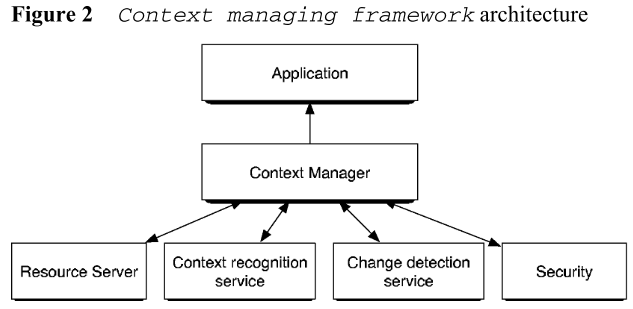
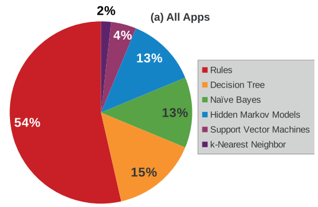
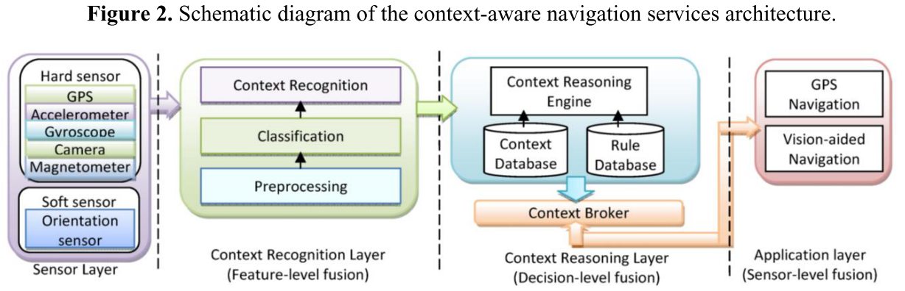

In another [survey](https://dymodi.github.io/Research/Literature-Reviews/Sensing/Scene-Ambience-Sensing-Monitoring-Related-Works), we only focus on single-source context sensing without complete application solution. We need broaden the scope and try to find more related works on multi-source sensor with complete upper layer application.

In this survey, we focus on the context-aware computing, which was a individual research field.

**Key Words**

* context-aware computing

**Taxonomy**

* Application: Navigation, Shopping Assistant, Conference Assistant
* Context: User Location, User activity, Device placement, 
* Sensor: GPS, Accelerometer, Gyroscope, Camera, Magnetometer
* Solution: Machine learning, 

**Comments**

* 

**Special Topics**

* Context-Aware Mobile Computing Survey, *Dartmouth00-Survey*

  * Highly cited survey paper, context are defined and classified. Many applications are shown.
  * Too early, most applications are based on simply location.
  * Context: Location, time, activity, light.
  * Applications: Shopping Assistant, Conference Assistant, etc.
* A survey on context-aware systems, *IJAHUC07-Survey*
  * Highly cited survey paper
  * Sensor classification: Physical sensors, Virtual sensors, Logical sensors.
  * Context attributs: Context type, Context value, Time stamp, Source, Confidence.

* Context-Aware Computing in IoT Survey, *IEEECST13-Survey*
* Highly cited survey paper, categorization of context (primary/secondary), 
  * **Design principles** for context awareness framework (middleware)
    * Comprehensive easy to learn and easy to use API
    * Automatic context life cycle management
    * Extended, rich, and comprehensive modelling
    * Monitoring and detect event
  * Subsection for "**Context Modeling**" methods:
    * Ontology based Modeling, the most popular method.
  * Subsection for "**Context Reasoning**" steps:
    * Context pre-processing
    * Sensor data fusion
    * Context inference: Generation of high-level context information using lower-level context.
  * Subsection for "**Context Reasoning**" methods:
    * Supervised learning
    * Unsupervised learning
    * Rules
    * Fuzzy logic
    * Ontology based
    * Probabilistic logic

* Context-aware navigation, *Sensors14-Navigation*
* Taxonomy: Navigation, User activity, Device placement, GPS, Accelerometer, Gyroscope, Camera, Magnetometer, Machine learning

* Context-aware computing in manufacturing, *IJCIM16-Concept*
  * Context-aware computing in Industry, a specific implementation.

* Context-Aware Computing, Learning, and Big Data, *IEEEIoTJ18-Survey*
  * Recent survey, good summary of IoT research trends and IoT platforms.
  * Context life cycle: Context Acquisition, Context Modelling, Context Reasoning, Context Distribution.

* Context-aware communication and computing, *Springer18-Book*
  * Book in 2018, shows the states-of-the-art.

##  Ref.

[Dartmouth00-Survey] Chen, G., & Kotz, D. (2000). **A survey of context-aware mobile computing research**. *Dartmouth Computer Science Technical Report TR2000-381*.

[IJAHUC07-Survey] Baldauf, M., Dustdar, S., & Rosenberg, F. (2007). **A survey on context-aware systems.** *International Journal of Ad Hoc and Ubiquitous Computing*, *2*(4), 263-277.

[IEEECST13-Survey] Perera, C., Zaslavsky, A., Christen, P., & Georgakopoulos, D. (2013). **Context aware computing for the internet of things: A survey**. *IEEE communications surveys & tutorials*, *16*(1), 414-454.

[Sensors14-Navigation] Saeedi, S., Moussa, A., & El-Sheimy, N. (2014). **Context-aware personal navigation using embedded sensor fusion in smartphones**. *Sensors*, *14*(4), 5742-5767.

[IJCIM16-Concept] Alexopoulos, K., Makris, S., Xanthakis, V., Sipsas, K., & Chryssolouris, G. (2016). **A concept for context-aware computing in manufacturing: the white goods case**. *International Journal of Computer Integrated Manufacturing*, *29*(8), 839-849.

[IEEEIoTJ18-Survey] Sezer, O. B., Dogdu, E., & Ozbayoglu, A. M. (2018). **Context-aware computing, learning, and big data in internet of things**: a survey. *IEEE Internet of Things Journal*, *5*(1), 1-27.

[Springer18-Book] Temdee, P., & Prasad, R. (2018). ***Context-aware communication and computing: Applications for smart environment***. Springer International Publishing.

**Industry Progress (Commercial SDK)**

- Skyhook: Cooperative partner of Apple in localization. Massive dataset on GPS/Wi-Fi/Cell-Tower/BLE. 

**Open Source Project**

* [SensingKit](https://www.sensingkit.org/): Multi-Platform Mobile Sensing Framework for Large-Scale Experiments
* [The Context Toolkit](http://contexttoolkit.sourceforge.net/) : Toolkit for context-aware applications
* [Aware](https://awareframework.com/) : Context Instrumentation Framework
* [The Pennyworth Project](https://www.pennyworthproject.org/) : Creating Context-Aware Tools for Everyday Use
* [CARSKit](https://github.com/irecsys/CARSKit) : Java-based context-aware recommendation engine

**Patents**

* [Microsoft](https://patents.google.com/patent/US7925995B2/en): Integration of location logs, GPS signals, and spatial resources for identifying user activities, goals, and context