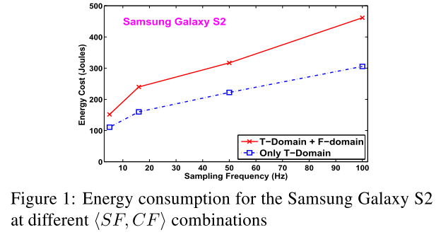
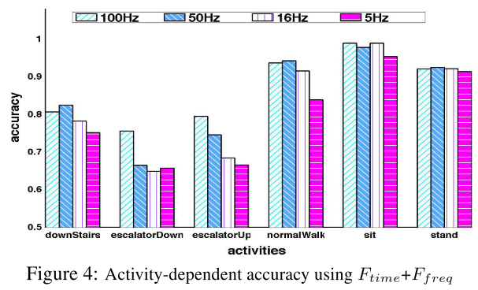

"Transportation/Mobiliy Mode" and "Activity Recognition" are two very related topics, since many studies consider "Walk/Run" as activities.

In this survey, I mainly focus on courier-related activities/mobilities (e.g. walk/riding) while ignoring other activities/mobilities (e.g. car/bus/keystroke).

**Keyword**

* Activity Recognition

* Transportation/Mobiliy Mode

  

**Taxonomy**

* Methods: ML, HMM, 
* Data Source: CDR,
* Sampling Rate: 100Hz

**Comments**

* Sampling Rate is one of the key barriers when applying the methods

**Papers**

* ISWC12: 
  * Trade-off between sampling frequence and classification performance.

  

* SenSys13:
  * Taxonomy: ML+HMM, Accelerator, 100Hz,
* TBD17: Activity-based
  * Taxonomy: CDR, 
* 

##  Ref.

[ISWC12] Yan, Z., Subbaraju, V., Chakraborty, D., Misra, A., & Aberer, K. (2012, June). **Energy-efficient continuous activity recognition on mobile phones: An activity-adaptive approach**. In *ISWC* (pp. 17-24). Ieee.

[SenSys13] Hemminki, S., Nurmi, P., & Tarkoma, S. (2013, November). **Accelerometer-based transportation mode detection on smartphones**. In *ACM SenSys* (pp. 1-14).

[TBD17] Jiang, S., Ferreira, J., & Gonzalez, M. C. (2017). **Activity-based human mobility patterns inferred from mobile phone data: A case study of Singapore.** *IEEE Transactions on Big Data*, *3*(2), 208-219.

**Industry Progress**

- 