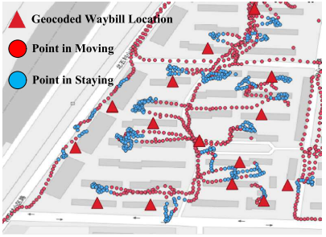

# Related Works of ETA

**Key Words**: Estimated Time of Arrival (ETA)

**Taxonomy**

* **Applications**: Express, Taxi, 
* **Problem**: Delivery Time, 
* **Solutions**:
* 

**Comments**

**Papers**

* Doing in One Go: Delivery Time Inference Based on Couriers’ Trajectories *[KDD 2020 JD]*
  * **Taxonomy**: Express, Delivery Time, 
  * **Contributions**:
    * Conceptual: present the first attempt to formalize the delivery time infer- ence problem.
    * Application: the system is deployed in JD Logistics and used internally.
  * The motivation of is to "*ease the burdens on the couriers*".
  * Straightforward solution: extract staying point.
    * Limitation of straightforward solutions: mismatch between noisy staying points and geocoded locations.
  * Proposed solutions: (1) Data Pre-processing (trajectory parsing); (2) Delivery Location Correction; (3) Delivery Event-based Matching;

## Ref.

[KDD 2020 JD] Ruan, Sijie, Zi Xiong, Cheng Long, Yiheng Chen, Jie Bao, Tianfu He, Ruiyuan Li, Shengnan Wu, Zhongyuan Jiang, and Yu Zheng. "Doing in One Go: Delivery Time Inference Based on Couriers' Trajectories." In *Proceedings of the 26th ACM SIGKDD International Conference on Knowledge Discovery & Data Mining*, pp. 2813-2821. 2020.

