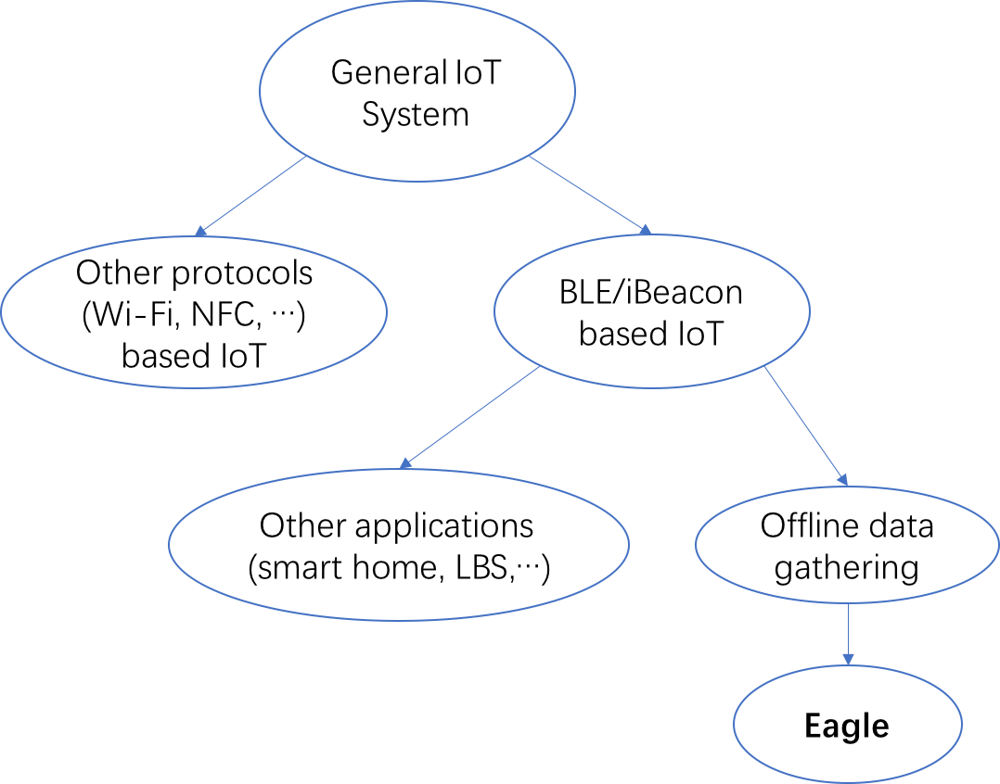

# Large Scale Offline Data Collecting

## 1 INTRODUCTION

* The importance of the problems addressed
* The novelty of the proposed solutions
* The technical depth
* The potential impact

**(The background of food delivery system)**

**(Challenges and motivations)**
* Deployment in the physical world of large scale BLE-based data gathering system
* Security and privacy protection 
* Data inconsistency 
* Energy consumption in large scale BLE beacon system

**(Related works)**

[Eagle relate works](https://github.com/dymodi/dymodi.github.io/blob/master/Research/Literature-Reviews/Eagle-Related-Works.md)

**(The solution we proposed)**

* Maximum-coverage deployment stragey
* Beacon encryption
* Data fusing
    * (Similar as Desheng's data fusing)
* Bayesian-based data validation and correction
* Green offline data gathering
    * "Green penalty" in the optimization problem of beacon deployment. (A advanced version of deployment strategy).
    * "Green beacon" (energy efficient in hardware design and broadcasting?)
    * Cellphone as beacon

**(The contribution of this paper)**

## 2 Motivation
**(Challenges and motivations)**

Offline data collecting is much more challenging than online data collecting due to many factors: The installation of IoT devices is time consuming and expensive; the measurements are subject to uncertainty due to sensing errors and other disturbances.

Challenges:
* Deployment in the physical world of large scale BLE-based data gathering system
    * Large scale IoT design lacks physical world depolyment. (Proof: [][])
    * Studies with real world deployment is small scale. (Proof: [][])
    * Different from typical scenarios: smart home, art museum, individual mall. (Detailed description)
* Security and privacy protection 
    * Ubiquitous BLE beacons has the risk of revealing privacies
    * （Similar as "Secure IoT"）
* Heterogenous data sources
    * Beacon location data
    * Beacon broadcast data received by targets's cellphone
    * Other data of targets (GPS, behaviors, ...)
* Data inconsistency 
    * Pervasive "dirty" data in the real world. (More explanition.)
    * Wrong data leads to wrong decision. (An example.)
* Energy consumption in large scale BLE beacon system
    * Pollutation brought by battery
    * Energy consumption in cellphone system
    

## 3 System Overview

## Evaluation

## Related Work

### Design Space

**(Offline data gathering related work)**

## Conclusion

## Ref.

