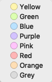

## Mendeley Markers

 

| Color  | Functions                                           |
| ------ | --------------------------------------------------- |
| Yellow | Normal high light                                   |
| Green  | Innovation / Advantages of the work                 |
| Blue   | Background knowledge                                |
| Purple |                                                     |
| Pink   | Well written phrases, might be use in future paper. |
| Red    | Key point                                           |
| Orange |                                                     |
| Grey   | Limitation of the paper where we can attack.        |

