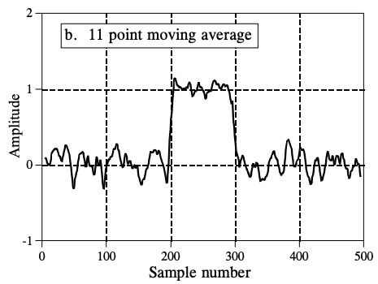
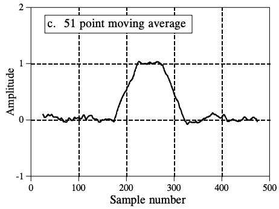

Digital filter can be used to process time series data. Some contents comes from the [introduction]([http://123.physics.ucdavis.edu/week_5_files/filters/digital_filter.pdf](http://123.physics.ucdavis.edu/week_5_files/filters/digital_filter.pdf)).

In signal processing, the function of a *filter* is to remove unwanted parts of the signal, such as random noise, or to extract useful parts of the signal, such as the components lying within a certain frequency range. [Here](http://www.dspguide.com/CH14.PDF) aslo said that Digital filters are used for two general purposes: (1) separation of signals that have been combined, and (2) restoration of signals that have been distorted in some way. 

**Input**

$$\mathbf{x_0, x_1, x_2, x_3, …, x_n}$$

**Output**

$$\mathbf{y_0, y_1, y_2, y_3, …, y_n}$$

### Examples of simple digital filters

1. Unity gain filter: $$\mathbf{y_n}=\mathbf{x_n}$$

2. Simple gain filter: $$\mathbf{y_n}= \mathbf{Kx_n}$$

3. Pure delay filter: $$\mathbf{y_n}=\mathbf{x_{n-1}}$$

4. Two-term difference filter: $$\mathbf{y_n}=\mathbf{x_n}-\mathbf{x_{n-1}}$$

5. Two-term average filter (This is a simple type of low pass filter as it tends to smooth out high-frequency variations in a signal): $$\mathbf{y_n}=\frac{\mathbf{x_n+x_{n-1}}}{2}$$

### Order of a digital filter

The *order* of a digital filter is the number of *previous* inputs (stored in the processor's memory) used to
calculate the current output.

### Digital filter coefficients

All of the digital filter examples given above can be written in the following general forms:

* Zero order: $$ \mathbf{y_n=a_0x_n} $$
* First order: $$ \mathbf{y_n=a_0x_n+a_1x_{n-1}} $$
* Second order: $$ \mathbf{y_n=a_0x_n+a_1x_{n-1}+a_2x_{n-2}} $$

The constants $$\mathbf{a_0, a_1, a_2, ...} $$ appearing in these expressions are called the *filter coefficients*. It is the values of these coefficients that determine the characteristics of a particular filter

### Recursive and non-recursive filters

A *recursive* filter is one which in addition to input values also uses previous *output* values. These, like the
previous input values, are stored in the processor's memory.

**Note:** Some people prefer an alternative terminology in which a non-recursive filter is known as an **FIR** (or Finite Impulse Response) filter, and a recursive filter as an **IIR** (or Infinite Impulse Response) filter.

### Order of a recursive (IIR) digital filter

The order of a recursive filter is the largest number of previous input or output values required to compute the current output.

### Coefficients of recursive (IIR) digital filters

A first-order recursive filter can be written in the general form

$$\mathbf{y_n=\frac{(a_0x_n+a_1x_{n-1}-b_1y_{n-1})}{b_0}}$$

The reason for expressing the filter in this way is that it allows us to rewrite the expression in the following
symmetrical form:

$$\mathbf{b_0y_n+b_1y_{n-1}=a_0x_n+a_1x_{n-1}}$$

### The transfer function of a digital filter

First of all, we must introduce the *delay operator*, denoted by the symbol $$\mathbf{z^{-1}}$$:

$$\mathbf{z^{-1}x_n=x_{n-1}}$$

Hence we have:

$$\mathbf{ \frac{y_n}{x_n} = \frac{a_0+a_1z^{-1}+a_2z^{-2}}{b_0+b_1z^{-1}+b_2z^{-2}}}$$

This is the general form of the transfer function for a second-order recursive (IIR) filter.

The transfer function of a second-order second-order (FIR) filter can therefore be expressed in the general form

$$\mathbf{ \frac{y_n}{x_n} = a_0+a_1z^{-1}+a_2z^{-2}}$$

### How Information is Represented in Signals

Fortunately, there are only two ways that are common for information to be represented in naturally occurring signals. We will call these: **information represented in the time domain**, and **information represented in the frequency domain**. 

The *step response* describes how information represented in the *time domain* is being modified by the system. In contrast, the *frequency response* shows how information represented in the f*requency domain* is being changed. 

**Time Domain Parameters**: risetime, overshoot, linear phase

**Frequency Domain Parameters**: passband, stopband, transition band, cutoff frequency, fast roll-off, passband ripple, stopband attenuation.

High-pass, band-pass and band-reject filters are designed by starting with a low-pass filter, and then converting it into the desired response. 

### Moving Average Filters

$$y[i]=\frac1M\sum^{M-1}_{j=0}x[i+j]$$

  

**Advantages of Digital Filter**

Compared with other methods that can process, 