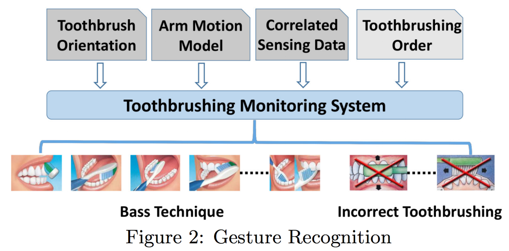
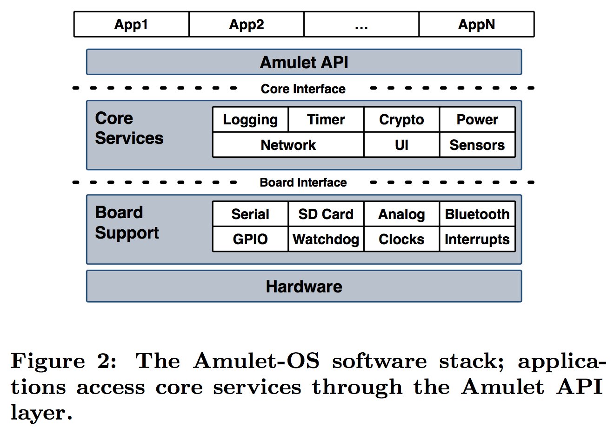

--- 
layout: post
title: Basic Facts on Paper Writing
date: Oct. 09, 2017
author: Yi DING
---
[comment]: # (Here are some basic facts on paper writing)

## Flowchart 
Border Line Width: 3 pound.

### Some system overview samples:

From SenSys 16 Huang's Paper:

    

From SenSys 16 Hester's Paper:

    

