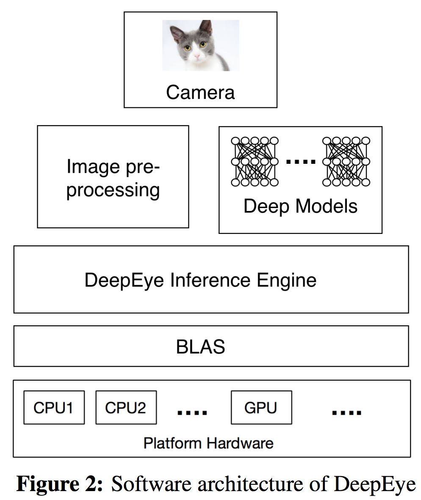
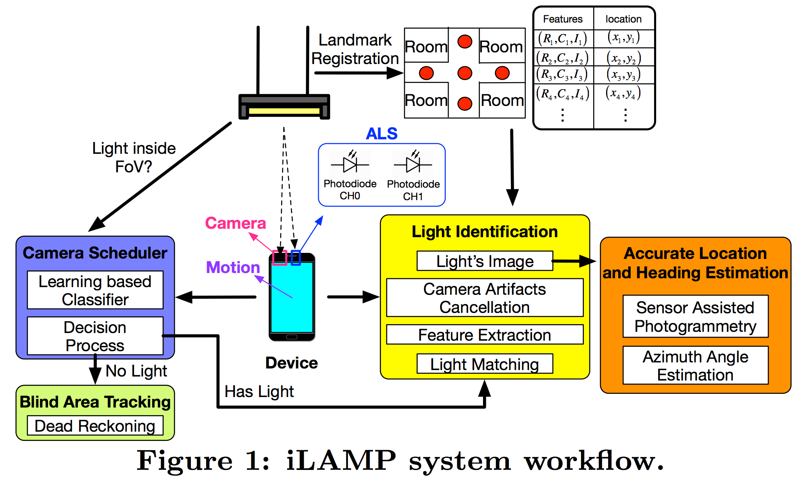
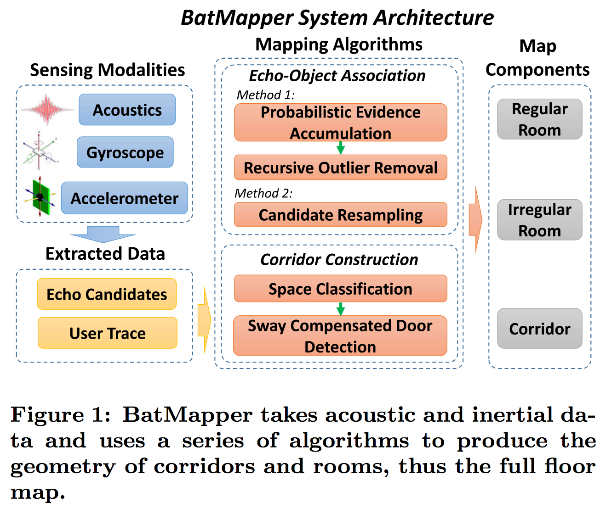
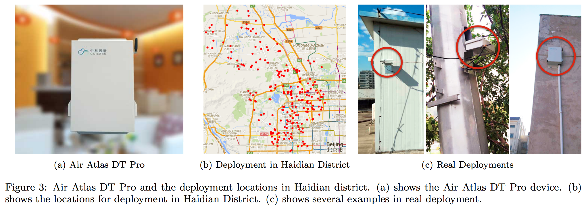

Here we introduce how to make figures, such as a illustrative figure in introduction, system overview, and evaluation diagrams.

Note that every figure should be infomative. A figure that shows very limited info is not a good figure.

## Figure Types

CDF, Boxplot, Flowchart, System Architechure, Framwork, 

## Illustrive Figure

In Introduction or Motivation, we might need some illustrative figures to show some information.

## Flowchart 

Border Line Width: 3 pound.

### Some system overview figure samples:

From SenSys 16 Huang's paper:

    

From SenSys 16 Hester's paper:

    

From MobiSys 17 Mathur's paper:

    

From MobiSys 17 Zhu's paper:

    

From MobiSys 17 Zhou's paper:

    

## Evaluation

### Some evaluation figure samples:
From SenSys 16 Meng's Paper:

    

