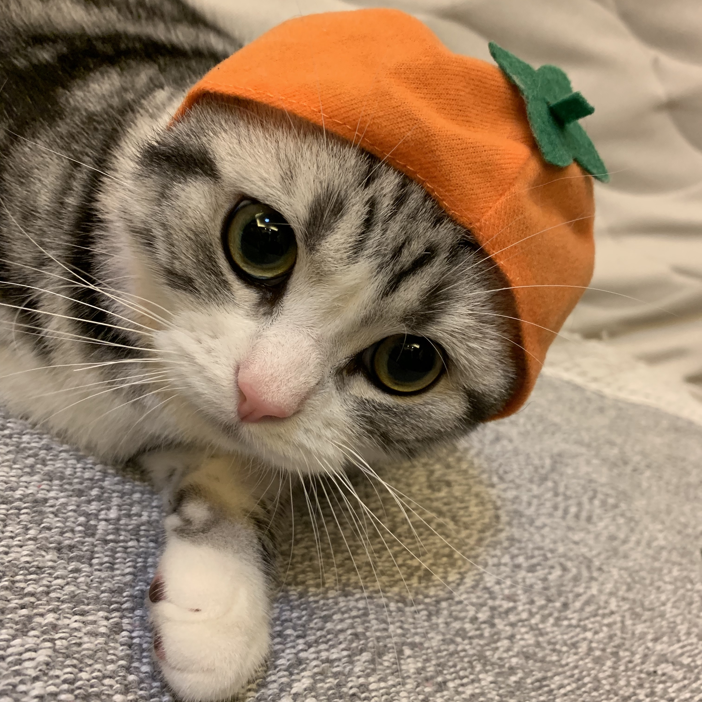

I am currently an Assistant Professor in Computer Science at The University of Texas at Dallas. Previously, I was a Postdoctoral Associate at MIT Institute for Data, Systems, and Society ([IDSS](https://idss.mit.edu/staff/postdoctoral-associate-ssrc/)) and Media Lab from 2022 to 2023. I received my Ph.D. in the Department of Computer Science and Engineering at the University of Minnesota in 2022. I have my Bachelor's and Master's degrees from Zhejiang University in China.

My research interests lie at the intersection of **cyber-physical systems (CPS)**, **mobile computing**, and **data mining**. I am interested in studying human behavior through smartphone sensing and machine learning in CPS and cyber-human systems (CHS) like *location-based services*, *urban delivery,* and *smart cities*. Some of the future projects will study how to integrate AI models like LLM into the systems.

I am looking for self-motivated Ph.D. students starting in Fall 24. Experience in mobile computing, machine learning, and/or data mining is preferred. If you are interested, please send your CV, Statement-of-Purpose, and transcripts to yi.ding *at* utdallas *dot* edu

Please find my CV [here](https://yi-ding.me/assets/files/CV_Yi.pdf).

**Recent News**

* Dec. 2023: Paper accepted by IEEE TMC.
* Nov. 2023: Presentation on NSF IoT/S&CC workshop at UW
* Sep. 2023: Paper accepted by VLDB 2024.
* Aug. 2023: Start Assistant Professor appointment at UT Dallas.
* Jul. 2023: Serve as program committee on the SIGCOMM'23 Posters and Demos.
* Apr. 2023: Co-authored paper accepted by ACM Transactions on Sensor Networks (TOSN).
* Mar. 2023: Serve as a reviewer for ACM SIGKDD 2023.
* Oct. 2022: Start postdoctoral associate appointment at MIT.
* Aug. 2022: Co-authored paper accepted by ACM SIGSPATIAL 2022.
* Aug. 2022: Present **Para-Pred** at KDD. Glad to see some new friends and old friends.
* Jul. 2022: Gave a talk at [Kargo](https://mykargo.com/).
* Jul. 2022: 1st-authored paper accepted by IEEE/ACM ToN.
* Jun. 2022: I gave a talk to the Location-based Service (LBS) team in ByteDance.
* May. 2022: Co-authored paper accepted by ACM SIGKDD'22.
* Apr. 2022: Selected to participate in the [CPS Rising Stars Workshop 2022](https://cps-rising-stars2022.com/).
* Apr. 2022: Co-authored paper accepted by ACM IMWUT (UbiComp'22).
* Feb. 2022: 2nd-authored paper accepted by ACM MobiCom'22.
* Jan. 2022: 1st-authored paper **P2-Loc** accepted by ACM IMWUT (UbiComp'22).
* Nov. 2021: Co-authored paper won the outstanding paper award at IEEE RTSS'21.
* Oct. 2021: **VALID** mentioned in MIT Technology Review.
* Oct. 2021: 1st-author paper **SmartLoc** accepted by ACM IMWUT (UbiComp'22).
* Aug. 2021: Co-authored paper accepted by IEEE RTSS'21.
* Jul. 2021: 2nd-author paper **ALWAES** accepted by ACM IMWUT (UbiComp'21).
* Jul. 2021: 1st-author paper accepted by IEEE/ACM ToN.
* Jul. 2021: [Data-set](https://tianchi.aliyun.com/dataset/dataDetail?dataId=106807) released of on-demand delivery order distribution in Shenzhen.
* Jul. 2021: 1st-author paper **RL-Dispatch** accepted by ACM IMWUT (UbiComp'21).
* Apr. 2021: 1st-author paper **VALID** accepted by SIGCOMM' 21.
* Apr. 2021: **aBeacon** paper presented at [NSDI' 21](https://www.usenix.org/conference/nsdi21/presentation/ding).
* Sep. 2020: [Data-set](https://tianchi.aliyun.com/dataset/dataDetail?dataId=76359) released of Bluetooth beacons, couriers' reports, and trajectories.
* Aug. 2020: **aBeacon** system introduced in [Alibaba Tech. officials accounts](https://mp.weixin.qq.com/s/7jVa-K-qUlYIrCg3YpPSEQ).
* Aug. 2020: 2nd-author paper **Trans-Loc** accepted by MobiCom' 20.
* Jun. 2020: 1st-author paper **aBeacon** accepted by NSDI' 21.

<!-- 

My cats, pipi (not "pip"), and turnip. -->

